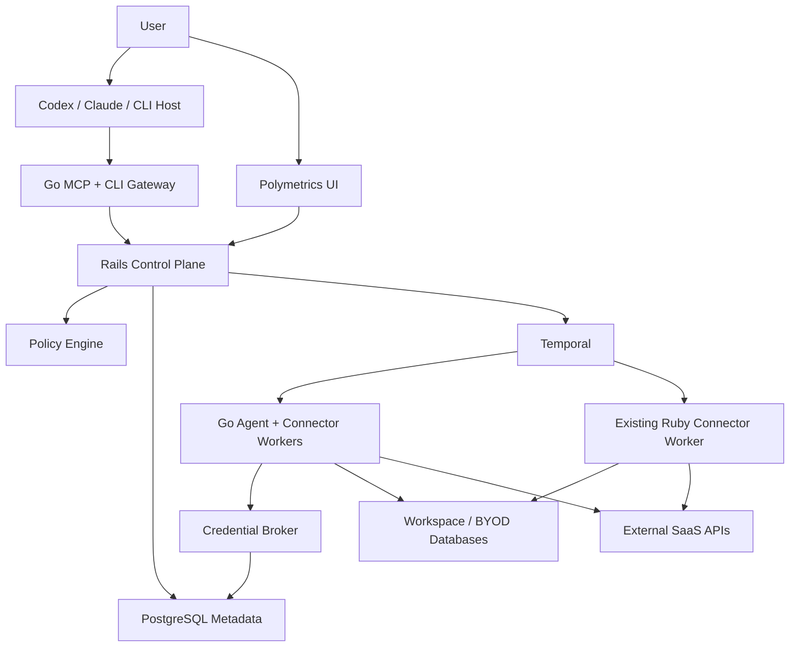
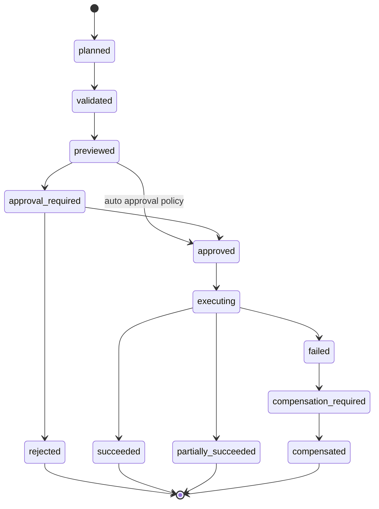

# Polymetrics Agentic ETL And Reverse ETL Plan

Date: 2026-06-20

Research source:

- Current workspace `/Users/karthiksivadas/Development/polymetrics-agentic-team/polymetrics-v2` is empty and not a Git repository.
- Researched latest fetched `origin/main` from `git@github.com:polymetrics-ai/polymetrics.git` in detached temporary worktree `/tmp/polymetrics-main-research.cIfYbD` and removed the worktree after research.
- Researched commit: `808a4c1 fix(local): use DEPLOY_SUFFIX variable in Containerfile.template`.
- Created Go skill: `/Users/karthiksivadas/.codex/skills/go-engineering`.

External references used:

- Go docs: https://go.dev/doc/
- Go release history: https://go.dev/doc/devel/release
- Go security: https://go.dev/doc/security/
- Go diagnostics: https://go.dev/doc/diagnostics
- Temporal Go SDK: https://docs.temporal.io/develop/go/
- MCP 2025-06-18 spec: https://modelcontextprotocol.io/specification/2025-06-18

## Executive Summary

Polymetrics already has the right core shape for an agentic data platform: Rails as a control plane, Temporal for durable orchestration, Ruby connector workers, workspace-scoped metadata, chat-driven pipeline actions, BYOD database support, and an existing read-oriented data agent. The missing pieces are the protection layer and execution surface that let agents take action safely:

1. A typed agent action model with planning, preview, approval, execution, and receipt states.
2. A real credential vault/broker for connector credentials instead of using raw JSONB connector configuration as the operational secret boundary.
3. A policy engine that decides which operations are read-only, preview-only, approval-required, or denied.
4. A Go runtime for agent-facing tools, connector workers, reverse-ETL execution, and MCP/CLI integration.
5. Reverse-ETL models/services/workflows on top of the existing `reverse_sync_*` schema tables.
6. Strict LLM boundaries: agents see schemas, capabilities, previews, and receipts, never raw credentials or generic execution primitives.

Recommended direction: keep Rails as the first control plane, add Go as a new agent/runtime layer beside the existing Ruby connector worker, integrate through Temporal task queues, then migrate performance-sensitive connector/runtime code to Go incrementally.

## Existing Polymetrics Implementation Findings

### Current Product Shape

Polymetrics is an open-source multi-source extraction, analytics, and visualization platform. The README describes multi-source data extraction, connection management, automated synchronization, DuckDB-backed analytics, charts, and dashboards.

### Rails Control Plane

Key files:

- `/tmp/polymetrics-main-research.cIfYbD/platform/app/models/connection.rb`
- `/tmp/polymetrics-main-research.cIfYbD/platform/app/models/connector.rb`
- `/tmp/polymetrics-main-research.cIfYbD/platform/app/models/sync.rb`
- `/tmp/polymetrics-main-research.cIfYbD/platform/app/models/sync_run.rb`
- `/tmp/polymetrics-main-research.cIfYbD/platform/config/routes.rb`

Observed model responsibilities:

- `Connector`: workspace-scoped connector definition/configuration, language, integration type, operations, schema cache, and async schema fetch.
- `Connection`: source-to-destination relationship, status state machine, schedule metadata, chat relationship.
- `Sync`: stream-level sync definition, sync mode, source schema, destination schema, cursor metadata.
- `SyncRun`: per-run state, counters, Temporal workflow IDs, partial success tracking, chat workflow signaling.

### Existing ETL Orchestration

Key files:

- `/tmp/polymetrics-main-research.cIfYbD/platform/app/services/temporal/workflows/connection_data_sync_workflow.rb`
- `/tmp/polymetrics-main-research.cIfYbD/platform/app/services/temporal/workflows/sync_workflow.rb`
- `/tmp/polymetrics-main-research.cIfYbD/platform/app/services/temporal/workflows/extractors/api_data_extractor_workflow.rb`
- `/tmp/polymetrics-main-research.cIfYbD/platform/app/services/temporal/workflows/extractors/database_data_extractor_workflow.rb`
- `/tmp/polymetrics-main-research.cIfYbD/platform/app/services/temporal/workflows/loaders/database_data_loader_workflow.rb`

Observed flow:

1. `Connections::StartDataSyncService` starts `ConnectionDataSyncWorkflow`.
2. `ConnectionDataSyncWorkflow` prepares `SyncRun` records and runs `SyncWorkflow` children sequentially.
3. `SyncWorkflow` extracts data, transforms it, then loads it into a database destination.
4. API and database extraction use Parquet-based batching and parallel chunk activities.
5. Transform uses streaming Polars logic, bloom-filter deduplication, and bulk writes.
6. Database loading writes batches through connector workflows.

This is a strong foundation. The workflow split is already close to what a Go Temporal runtime should preserve.

### Connector Runtime

Key files:

- `/tmp/polymetrics-main-research.cIfYbD/ruby_connectors/lib/ruby_connectors/core/base_connector.rb`
- `/tmp/polymetrics-main-research.cIfYbD/ruby_connectors/lib/ruby_connectors/temporal_worker.rb`
- `/tmp/polymetrics-main-research.cIfYbD/ruby_connectors/lib/ruby_connectors/temporal/workflows/write_database_data_workflow.rb`
- `/tmp/polymetrics-main-research.cIfYbD/ruby_connectors/lib/ruby_connectors/temporal/activities/write_database_data_activity.rb`
- `/tmp/polymetrics-main-research.cIfYbD/platform/config/connectors.yml`

Current connectors:

- GitHub, DuckDB, Salesforce, Freshdesk, PostgreSQL, Stripe, Snowflake, Deep Research.
- Connector language enum supports `ruby`, `python`, `javascript`, but not `go`.
- Connector operation concepts already exist: `connect`, `read`, `write`, `catalog`, `query`.

The current Ruby base connector is intentionally small: `connect`, `read`, `write`, `catalog`, `validate_query`. This is a good model for a Go connector contract.

### Existing Data Agent

Key files:

- `/tmp/polymetrics-main-research.cIfYbD/platform/app/controllers/api/v1/agents/data_agent_controller.rb`
- `/tmp/polymetrics-main-research.cIfYbD/platform/app/services/chat_agent/message_service.rb`
- `/tmp/polymetrics-main-research.cIfYbD/platform/app/services/ai/etl/base_service.rb`
- `/tmp/polymetrics-main-research.cIfYbD/platform/app/services/temporal/workflows/agents/data_agent/chat_processing_workflow.rb`
- `/tmp/polymetrics-main-research.cIfYbD/platform/app/services/temporal/workflows/agents/data_agent/process_assistant_query_workflow.rb`
- `/tmp/polymetrics-main-research.cIfYbD/platform/app/services/temporal/workflows/agents/data_agent/sql_generation_workflow.rb`

Observed flow:

1. User starts chat through `POST /api/v1/agents/data_agent/chat`.
2. Chat workflow invokes `Ai::Etl::BaseService`.
3. AI connector selection creates pipeline actions.
4. Connection creation and sync initiation happen automatically.
5. Workflow waits for sync completion.
6. RLM path attempts analysis; SQL fallback generates SELECT queries, validates them through connector workflows, then reads data.
7. Summary is created as assistant output.

Current agent is read/analysis-oriented. It does not yet provide an agent-safe mutation path.

### Pipeline Action Model

Key files:

- `/tmp/polymetrics-main-research.cIfYbD/platform/app/models/pipeline.rb`
- `/tmp/polymetrics-main-research.cIfYbD/platform/app/models/pipeline_action.rb`
- `/tmp/polymetrics-main-research.cIfYbD/platform/app/models/pipeline_action/action_data_validator.rb`
- `/tmp/polymetrics-main-research.cIfYbD/platform/app/blueprints/chat_messages_blueprint.rb`

Current action types:

- `connector_selection`
- `connection_creation`
- `sync_initialization`
- `query_generation`
- `query_execution`
- `rlm_execution`

Needed new action types:

- `agent_plan`
- `policy_check`
- `credential_grant`
- `reverse_sync_plan`
- `reverse_sync_preview`
- `approval_request`
- `approval_decision`
- `reverse_sync_execution`
- `execution_receipt`
- `compensation`

### Reverse ETL State

The schema already includes:

- `reverse_syncs`
- `reverse_sync_runs`
- `reverse_sync_records`
- `reverse_sync_mappings`

But repository search found no Rails models, services, controllers, or workflows implementing these tables. This means reverse ETL has a database skeleton but not a product/control-plane implementation.

This is an opportunity: implement reverse ETL using these existing tables, but add agent action/approval/security records around them.

### Credential And Workspace Data Security

Existing security pieces:

- `WorkspaceDatabaseConfig` encrypts BYOD database credentials with Rails encryption.
- `Encryption::KeyManager` and `Encryption::FieldEncryptor` implement workspace DEKs protected by an environment MEK.
- `WorkspaceSyncWriteRecord` stores BYOD sync data encrypted.
- Sync records can route through platform or workspace database stores.

Gaps:

- `connectors.configuration` and `connections.configuration` are JSONB. They appear to hold connector config and likely secrets.
- There is no dedicated credential reference/grant model for agent actions.
- There is no policy-controlled secret broker for workers.
- Temporal workflow inputs/results must not contain secrets, but current connector configs are commonly passed through workflow params.

Before agents can mutate external systems, credentials need a stricter boundary.

### UI Surface

Key files:

- `/tmp/polymetrics-main-research.cIfYbD/ui/src/service/dataAgent.ts`
- `/tmp/polymetrics-main-research.cIfYbD/ui/src/components/data-agent/PipelineStepper.tsx`
- `/tmp/polymetrics-main-research.cIfYbD/ui/src/types/dataAgent.ts`

Current UI renders data-agent chat history, messages, pipeline actions, sync status, generated queries, RLM outputs, and summaries. It has no approval/preview/receipt views yet.

## Target Architecture

### Design Tenets

1. Agent-safe by construction: no generic shell, generic HTTP, generic SQL write, or raw credential tool.
2. Preview before mutation: every write has plan, validation, dry-run/preview, approval, execution, and receipt.
3. Durable execution: Temporal owns retries, cancellation, heartbeats, recovery, and long-running work.
4. Least privilege: credentials are scoped by workspace, connector, operation, and time.
5. Auditable action ledger: every decision, prompt-derived plan, tool input, approval, and external mutation is traceable.
6. Typed contracts: all agent tools and connector operations have explicit input/output schemas.
7. Bounded outputs: agents get summaries, schemas, previews, and result references, not unlimited raw data.
8. Incremental migration: Rails and Ruby connectors continue working while Go services are added.

### Component Diagram



## Proposed Go Runtime

### Repo Layout

Add a new Go module at the repo root:

```text
go/
  go.mod
  go.sum
  cmd/
    polymetrics-agent/
      main.go            # CLI entry point
    polymetrics-mcp/
      main.go            # MCP server
    go-agent-worker/
      main.go            # Temporal worker
    go-connector-worker/
      main.go            # Connector task queue worker
  internal/
    activities/
    auth/
    config/
    connectors/
    credentials/
    ledger/
    mcp/
    policy/
    redaction/
    schema/
    temporal/
    workflows/
```

Rationale:

- It isolates Go from Rails/Ruby while still living in the monorepo.
- `cmd/` gives independent deployable binaries.
- `internal/` prevents accidental public APIs before contracts stabilize.

### Go Services

1. `polymetrics-mcp`: HTTP MCP server for LLM clients. Local STDIO can be added later for development, but production should use HTTP plus OAuth-style bearer auth.
2. `polymetrics-agent`: CLI for human and agent workflows in terminals.
3. `go-agent-worker`: Temporal worker for agent action workflows, policy checks, approval waits, previews, and reverse-ETL orchestration.
4. `go-connector-worker`: Temporal worker for Go connector activities on `go_connectors_queue`.

### Go Connector Contract

```go
type Connector interface {
	Name() string
	Capabilities() Capabilities
	Check(ctx context.Context, ref CredentialRef) error
	Catalog(ctx context.Context, ref CredentialRef) (Catalog, error)
}

type Reader interface {
	Read(ctx context.Context, req ReadRequest) (RecordStream, error)
}

type Writer interface {
	ValidateWrite(ctx context.Context, req WriteRequest) (ValidationResult, error)
	DryRunWrite(ctx context.Context, req WriteRequest) (WritePreview, error)
	Write(ctx context.Context, req WriteRequest) (WriteReceipt, error)
}

type QueryValidator interface {
	ValidateQuery(ctx context.Context, req QueryValidationRequest) (QueryValidationResult, error)
}
```

Important constraints:

- `CredentialRef` is opaque. It references a grant, not a secret.
- Activities resolve credentials just-in-time through the credential broker.
- Workflow inputs never include plaintext credentials.
- Every write request includes an idempotency key.

### Temporal Task Queues

Existing:

- `platform_queue`
- `ruby_connectors_queue`
- `python_connectors_queue`
- `javascript_connectors_queue`

Add:

- `go_agent_queue`: agent workflows and safe orchestration activities.
- `go_connectors_queue`: Go connector read/write/catalog/query activities.
- Optional later: `go_high_risk_actions_queue` for separately isolated mutating workloads.

## Agent Action Lifecycle

### State Machine



### New Ledger Tables

Add these alongside existing chat/pipeline tables:

```text
agent_actions
  id
  workspace_id
  user_id
  chat_id
  pipeline_action_id
  action_type
  risk_level
  status
  plan_hash
  idempotency_key
  temporal_workflow_id
  temporal_run_id
  requested_by
  requested_via        # ui, cli, mcp
  metadata jsonb
  created_at
  updated_at

agent_action_steps
  id
  agent_action_id
  position
  step_type           # plan, policy, preview, approval, execute, receipt
  tool_name
  input_hash
  output_ref
  status
  error_code
  metadata jsonb
  created_at
  updated_at

agent_approvals
  id
  agent_action_id
  approver_id
  decision            # approved, rejected
  reason
  approved_scope jsonb
  expires_at
  created_at

credential_refs
  id
  workspace_id
  connector_id
  name
  status
  scopes jsonb
  metadata jsonb
  created_at
  updated_at

credential_versions
  id
  credential_ref_id
  version
  encrypted_payload
  encryption_key_version
  status
  rotated_at
  created_at

credential_grants
  id
  credential_ref_id
  agent_action_id
  operation
  expires_at
  status
  created_at
```

Why new tables instead of overloading `pipeline_actions`:

- `pipeline_actions` are good chat UI artifacts.
- `agent_actions` need stronger lifecycle, approval, credential grant, idempotency, and audit semantics.
- Link them through `pipeline_action_id` so UI can render them in the existing chat timeline.

## Credential Vault And Broker

### Short-Term

1. Keep Rails as the initial secret writer because it already has encryption infrastructure.
2. Add `CredentialRef`, `CredentialVersion`, and `CredentialGrant` Rails models.
3. Migrate connector credential fields out of `connectors.configuration` into `credential_versions`.
4. Replace connector configs passed into workflows with redacted config plus `credential_ref_id`.
5. Add an internal credential broker endpoint or gRPC service only accessible by trusted workers.

### Long-Term

Move to a dedicated secret backend:

- Cloud KMS, HashiCorp Vault, or equivalent.
- Per-workspace DEKs wrapped by KMS.
- Short-lived worker grants.
- Audit every secret resolution.

### Rules

- LLM prompts never receive credentials.
- MCP resources never return credentials.
- Temporal workflow history never contains credentials.
- Workers resolve credentials inside activities only.
- Logs and traces include credential ref IDs, not secret values.
- Connector configs sent to agents are redacted and capability-oriented.

## Policy Engine

### V1 Policy Model

Start with a Rails/Go DB-backed policy engine rather than introducing OPA/Cedar immediately.

Policy dimensions:

- Workspace.
- User role.
- Connector.
- Operation: read, query, catalog, dry_run, write, admin.
- Destination risk.
- Data class: public, internal, PII, financial, credential-like.
- Row count/byte count.
- Time window.
- Requested via: UI, CLI, MCP.

Decision result:

```json
{
  "decision": "allow | deny | approval_required",
  "risk_level": "low | medium | high | critical",
  "reasons": [],
  "required_approvers": [],
  "limits": {
    "max_rows": 1000,
    "max_batch_size": 100,
    "expires_at": "..."
  }
}
```

### V2 Policy Model

Introduce OPA or Cedar only when:

- Policy authoring needs delegation to customers.
- Policies become too complex for DB records.
- External audit/compliance demands a formal policy language.

## MCP And CLI Surface

### MCP Resources

Expose context only:

- `polymetrics://workspaces/{workspace_id}/connectors`
- `polymetrics://connectors/{connector_id}/schema`
- `polymetrics://connections/{connection_id}/syncs`
- `polymetrics://sync-runs/{sync_run_id}`
- `polymetrics://reverse-syncs/{reverse_sync_id}`
- `polymetrics://agent-actions/{agent_action_id}/preview`
- `polymetrics://agent-actions/{agent_action_id}/receipt`

### MCP Tools

Read/context tools:

- `connectors.list`
- `connectors.catalog`
- `connections.test`
- `syncs.status`
- `query.validate_select`
- `query.preview`

Plan/preview tools:

- `etl.plan`
- `etl.start`
- `reverse_etl.plan`
- `reverse_etl.preview`
- `reverse_etl.dry_run`

Approval/execution tools:

- `agent_action.request_approval`
- `agent_action.get_status`
- `reverse_etl.execute_approved`
- `agent_action.cancel`

Do not expose:

- `run_shell`
- `run_any_sql`
- `http_request`
- `write_records`
- `get_credentials`
- Any generic connector method that bypasses policy.

### CLI Commands

```bash
polymetrics agent connectors list --workspace <id>
polymetrics agent catalog --connector <id>
polymetrics agent etl plan "<request>"
polymetrics agent etl start --plan <plan-id>
polymetrics agent reverse-etl plan "<request>"
polymetrics agent reverse-etl preview --action <action-id>
polymetrics agent reverse-etl approve --action <action-id>
polymetrics agent reverse-etl execute --action <action-id>
polymetrics agent action status <action-id>
```

CLI uses the same control-plane API and policy engine as MCP and UI.

## Reverse ETL Implementation Plan

### Product Flow

Example user request:

> Find Freshdesk tickets from synced data where SLA is breached and account ARR is high, then update Freshdesk priority to urgent and add a note.

Safe flow:

1. Agent creates `agent_action` and `reverse_sync_plan`.
2. Source query is validated as read-only.
3. Destination connector capability is checked for update and notes.
4. Preview returns masked sample rows and destination changes.
5. Policy classifies as high risk because it mutates customer support records.
6. User approves exact action scope: connector, object type, row count, fields, expiration.
7. Workflow executes in small batches.
8. Every record gets a `reverse_sync_record` with status, external ID, destination response, and error class.
9. UI and MCP show receipt summary.

### Rails Models To Add

Use existing schema:

- `ReverseSync`
- `ReverseSyncRun`
- `ReverseSyncRecord`
- `ReverseSyncMapping`

Add relationships:

- `ReverseSync belongs_to :workspace`
- `ReverseSync belongs_to :source_connector`
- `ReverseSync belongs_to :destination_connector`
- `ReverseSync has_many :reverse_sync_runs`
- `ReverseSync has_many :reverse_sync_mappings`
- `ReverseSyncRun has_many :reverse_sync_records`

Add validations:

- Source query/table required.
- Destination connector must support write.
- Mapping destination fields must exist in catalog.
- Sync mode must match connector capability.
- Workspace ownership must be enforced.

### Temporal Workflows

Add:

- `AgentActionWorkflow`
- `ReverseEtlPlanWorkflow`
- `ReverseEtlPreviewWorkflow`
- `ReverseEtlApprovalWorkflow`
- `ReverseEtlExecutionWorkflow`
- `CredentialRotationWorkflow`

Workflow responsibilities:

- Workflows orchestrate.
- Activities perform DB calls, LLM calls, connector calls, policy checks, credential resolution, and external writes.
- Approval waits use Temporal signals.
- Mutating activities require idempotency keys.

### Reverse ETL Activities

- `CreateAgentActionActivity`
- `GenerateReverseEtlPlanActivity`
- `ValidateSourceQueryActivity`
- `ValidateDestinationWriteActivity`
- `RunPolicyCheckActivity`
- `CreatePreviewActivity`
- `RequestApprovalActivity`
- `ResolveCredentialGrantActivity`
- `ExecuteDestinationBatchActivity`
- `RecordExecutionReceiptActivity`
- `CompensateDestinationBatchActivity`

## ETL Modernization Plan

Do not rewrite the existing ETL path first. Instead:

1. Add Go connector support to the existing Temporal architecture.
2. Let Rails continue creating `Connection`, `Sync`, and `SyncRun`.
3. Add `go` to `Connector.connector_language`.
4. Add `go_connectors_queue` to loader/extractor dispatch.
5. Implement one Go connector end to end, preferably PostgreSQL or a simple API connector.
6. Compare Ruby and Go performance, memory, error behavior, and operational visibility.
7. Move high-volume database extraction/loading to Go only after contract tests are stable.

## UI Plan

Add UI support for new pipeline actions:

- Plan card: shows requested action, source, destination, risk, and fields.
- Policy card: allow/deny/approval-required, reasons, limits.
- Preview card: masked rows, destination diff, estimated row count.
- Approval card: approve/reject, scope, expiration, warning copy.
- Execution card: progress, records loaded/failed, retry count.
- Receipt card: external IDs, error classes, downloadable audit summary.

Add action types to:

- `ui/src/types/dataAgent.ts`
- `ui/src/components/data-agent/*`
- `platform/app/blueprints/chat_messages_blueprint.rb`
- `platform/app/models/pipeline_action/action_data_validator.rb`

## Security Controls

### LLM Boundary

- Prompt includes connector names, capabilities, schemas, redacted config, and policy results only.
- Prompt excludes tokens, passwords, raw customer secrets, unmasked PII, private URLs, and raw large datasets.
- LLM can propose a plan but cannot execute mutation directly.
- Server validates all plan fields independently.

### Tool Boundary

- Every tool has a JSON input schema and output schema.
- Tool input is validated before business logic.
- Sensitive tools require confirmation and server-side policy pass.
- Tool outputs are redacted and bounded.
- Tool invocations are logged with action ID and trace ID.

### Data Boundary

- Row previews are capped.
- PII fields are masked by schema classification.
- Large datasets are stored as references, not passed through MCP.
- BYOD data remains in workspace database when possible.

### Network Boundary

- Connector workers have egress allowlists.
- Internal credential broker is reachable only by worker identity.
- MCP server uses HTTPS in production.
- Access tokens are bearer tokens in headers, never query params.

### SQL Boundary

- Read queries are SELECT-only.
- SQL identifiers are allowlisted against known schemas.
- Mutations use connector write APIs or parameterized SQL generated by server code, not LLM-generated SQL.
- Query preview has row and timeout limits.

## Observability

Metrics:

- Agent actions by status/risk/connector.
- Approval wait time.
- Policy decision counts.
- Tool invocation latency and error rate.
- Credential grant resolution count and denial count.
- Records/sec and bytes/sec per connector.
- Reverse-ETL per-record failure classes.
- Temporal activity retries and timeout counts.

Tracing:

- Propagate trace IDs from UI/MCP/CLI into Rails and Go workers.
- Include workspace ID, action ID, workflow ID, run ID, connector ID, and operation.
- Do not attach raw data or secrets as span attributes.

Logs:

- Structured JSON logs.
- Redaction library shared by API, Go runtime, and connector workers.
- One audit log per external mutation batch and per record receipt.

## Testing And Verification

### Unit

- Policy decisions.
- Credential redaction.
- Tool schema validation.
- SQL identifier validation.
- Field mapping transforms.
- Connector capability dispatch.

### Integration

- MCP tool invocation through Rails auth.
- CLI auth and workspace selection.
- Credential broker with worker identity.
- Temporal workflow plan -> approval -> execute.
- Reverse ETL into sandbox destinations.

### Contract

For every connector:

- `Check`
- `Catalog`
- `Read`
- `ValidateWrite`
- `DryRunWrite`
- `Write`
- Idempotency behavior.
- Rate limit behavior.
- Error classification.

### Security

- `govulncheck ./...` for Go.
- Secret scanning for logs and fixtures.
- Fuzz tests for tool inputs, SQL validation, field mapping.
- Prompt injection tests where source data attempts to override tool rules.
- Authorization tests across workspaces.

### Temporal

- Workflow replay tests for Go workflows.
- Activity idempotency tests.
- Cancellation tests.
- Approval timeout tests.
- Partial failure and compensation tests.

## Phased Roadmap

### Phase 0 - Foundations Already Completed In This Session

Deliverables:

- Created `go-engineering` Codex skill with fundamentals, advanced Go, production practices, and agentic ETL references.
- Researched main branch and mapped current architecture/gaps.
- Produced this architecture plan.

### Phase 1 - Rails Agent Action Ledger And Reverse ETL Models

Deliverables:

- Add Rails models for existing `reverse_sync_*` tables.
- Add migrations/models for `agent_actions`, `agent_action_steps`, `agent_approvals`, `credential_refs`, `credential_versions`, and `credential_grants`.
- Add pipeline action types for plan, preview, approval, execution, receipt.
- Add read-only API endpoints for action status and previews.

Acceptance:

- A chat request can create an `agent_action` linked to a pipeline action.
- Reverse sync definitions can be created and validated without execution.
- UI can render a plan/preview placeholder.

### Phase 2 - Go Runtime Skeleton

Deliverables:

- Add `/go` module.
- Add `polymetrics-agent`, `polymetrics-mcp`, `go-agent-worker`, `go-connector-worker`.
- Add config, auth, logging, tracing, health checks.
- Add Temporal client/worker startup.
- Add CI commands: `go test ./...`, `go test -race ./...`, `go vet ./...`, `govulncheck ./...`.

Acceptance:

- Go workers start locally against Temporal.
- MCP server exposes read-only `connectors.list` using Rails auth.
- CLI can list connectors for a workspace.

### Phase 3 - Credential Vault/Broker

Deliverables:

- Move sensitive connector credentials to `credential_versions`.
- Redact `connectors.configuration` and `connections.configuration`.
- Add credential broker endpoint/service.
- Add worker identity and grant validation.
- Add audit records for secret resolution.

Acceptance:

- No new workflow input includes plaintext credentials.
- Connector activity can resolve credentials through a grant.
- Secret values are absent from logs, traces, pipeline actions, and MCP resources.

### Phase 4 - Policy Engine And Approval

Deliverables:

- Implement policy decision service.
- Add approval request/decision API.
- Add Temporal signal path for approval wait/resume.
- Add UI approval card.
- Add MCP/CLI approval status tools.

Acceptance:

- Low-risk read previews can auto-allow.
- High-risk reverse-ETL writes pause for approval.
- Rejection stops execution and records reason.

### Phase 5 - Reverse ETL Preview And Dry Run

Deliverables:

- Implement `reverse_etl.plan`.
- Validate source SELECT query.
- Validate destination write capability.
- Generate field mappings.
- Produce masked preview.
- Run destination dry-run where connector supports it.

Acceptance:

- Agent can propose a reverse-ETL plan from chat, CLI, or MCP.
- Preview shows row count estimate, masked sample, field diff, and risk.
- No external mutation happens in this phase.

### Phase 6 - Approved Reverse ETL Execution

Deliverables:

- Implement execution workflow and batch activity.
- Write `reverse_sync_runs` and `reverse_sync_records`.
- Add idempotency keys and retry behavior.
- Add per-record receipt and failure classification.
- Add cancellation support.

Acceptance:

- Approved action writes to sandbox destination.
- Re-running with same idempotency key does not duplicate mutations.
- Partial failures produce actionable receipts.

### Phase 7 - Go Connector Runtime Expansion

Deliverables:

- Add Go connector registry.
- Add one database connector and one API connector.
- Add contract test harness.
- Add `go` connector language support in Rails.
- Add `go_connectors_queue` dispatch in extract/load paths.

Acceptance:

- A Go connector can catalog, read, preview write, and write through Temporal.
- Existing Ruby connectors still work.
- Connector tests run in CI.

### Phase 8 - Hardening And Scale

Deliverables:

- Egress controls.
- Rate limiting per workspace/connector/action.
- Replay tests and workflow versioning strategy.
- PII classification/masking.
- Customer-configurable policy.
- Production dashboards and alerts.

Acceptance:

- Security tests cover cross-workspace access, prompt injection, secret leakage, and unauthorized mutation.
- Operational dashboards show action throughput, failures, approval latency, and connector health.

## First Vertical Slice

Recommended first user-visible slice:

> From Codex or Claude CLI, ask Polymetrics to inspect available connectors, plan a Freshdesk reverse-ETL update from synced analytics data, preview the exact changes, ask for approval, then execute only after approval against a sandbox Freshdesk account.

Why this slice:

- Exercises MCP/CLI entry.
- Exercises Rails auth/workspace scoping.
- Exercises policy and approval.
- Exercises credential broker.
- Exercises existing sync data as source.
- Exercises reverse-ETL tables.
- Exercises a real API destination.
- Keeps blast radius controlled through sandbox and row limits.

## Risks

1. Credentials in JSONB config are the biggest blocker for safe agent execution.
2. Existing chat workflow auto-creates connections and starts syncs after connector selection; mutation workflows must not auto-execute the same way.
3. Reverse-ETL schema exists but lacks implementation; migrations may have come from an unmerged or manually altered schema state, so verify migration history before relying on schema-only tables.
4. Temporal workflow histories can accidentally capture secrets if activity inputs are not redesigned.
5. MCP tools can become unsafe if generic tools are added for convenience.
6. Prompt injection from synced data can target the agent; tool execution must depend on server policy, not model obedience.
7. Go and Rails encryption interoperability needs a deliberate design. Do not casually share Rails encryption internals with Go workers.

## Immediate Next Steps

1. Verify the reverse-ETL migrations that produced `reverse_sync_*` tables and add missing migration files if schema drift exists.
2. Add Rails `AgentAction` and `ReverseSync` model layer with tests.
3. Design credential ref migration for connector configs.
4. Scaffold `/go` with Temporal worker and MCP server skeleton.
5. Implement read-only MCP resource/tools first.
6. Add policy engine in deny-by-default mode.
7. Build reverse-ETL preview before any write execution.
