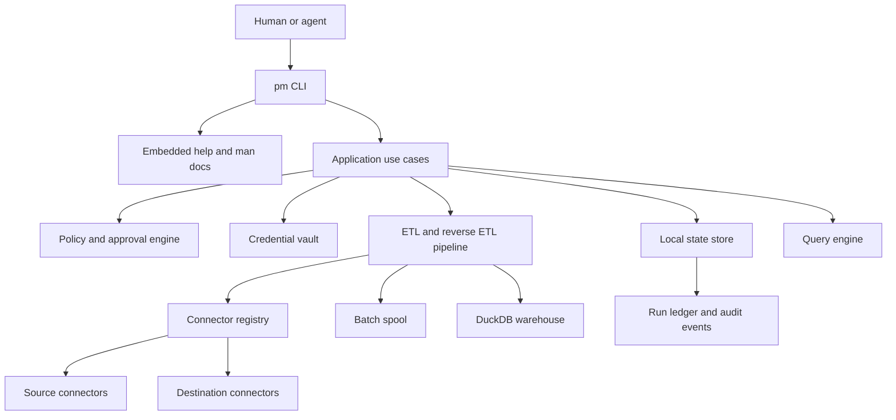
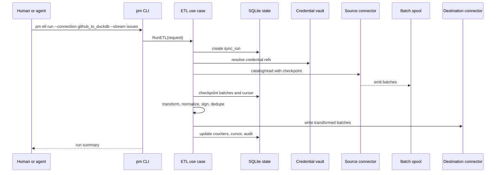
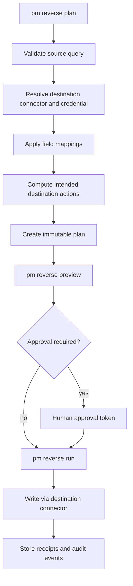

# Polymetrics Go CLI Monolith PRD and Architecture

Status: Draft for review
Date: 2026-06-24
Owner: Polymetrics engineering
Target implementation: Single Go CLI binary

## 1. Executive Summary

Polymetrics should be rewritten as a Go-only CLI monolith that can run ETL, reverse ETL, catalog discovery, query execution, credential management, and agent-safe operational workflows without Rails, Ruby workers, Temporal, Redis, or a web UI.

The new product is a local-first command line system named `pm` in this document. It is designed for two audiences:

1. Humans who want a detailed, Linux-man-page-style CLI for configuring connectors, credentials, ETL, and reverse ETL.
2. Agents such as Codex, Claude, and other LLM systems that need stable, typed CLI commands to inspect data systems and take actions on behalf of a user in a protective, auditable way.

The architecture keeps the strongest ideas from the current Polymetrics implementation:

- Connector metadata, connection specifications, stream schemas, catalog discovery, read operations, write operations, and query validation.
- Connection-to-connection syncs with source connector, destination connector, stream-level syncs, cursor fields, primary keys, and sync modes.
- Batch-oriented extraction with checkpointing, resumability, and durable run state.
- Reverse ETL entities: reverse syncs, mappings, runs, records, destination actions, and per-record status.
- Analytics/query workflows against a local warehouse.

The rewrite intentionally removes distributed control-plane complexity:

- No Rails API as the primary runtime.
- No Ruby connector worker runtime.
- No Temporal workflow dependency.
- No Redis/Dragonfly batch metadata dependency.
- No separate platform service required for local operation.

The replacement is one Go binary with internal packages, an embedded local state store, encrypted terminal-managed credentials, embedded help/man documentation, and connector implementations compiled into the binary.

## 2. Research Basis From Existing Polymetrics

Research was performed against the latest fetched `origin/main` worktree at commit `808a4c1` from the Polymetrics repository.

Key source areas inspected:

- `docs/etl/architecture.md`
- `platform/app/models/connector.rb`
- `platform/app/models/connection.rb`
- `platform/app/models/sync.rb`
- `platform/app/models/sync_run.rb`
- `platform/config/connectors.yml`
- `platform/app/services/temporal/workflows/connection_data_sync_workflow.rb`
- `platform/app/services/temporal/workflows/sync_workflow.rb`
- `platform/app/services/temporal/workflows/api_data_extractor_workflow.rb`
- `platform/app/services/temporal/workflows/database_data_extractor_workflow.rb`
- `platform/app/services/temporal/workflows/streaming_transform_workflow.rb`
- `platform/app/services/temporal/activities/streaming_transform_activity.rb`
- `platform/app/services/temporal/activities/load_data_activity.rb`
- `platform/app/services/ruby_connectors/temporal/activities/write_database_data_activity.rb`
- `ruby_connectors/lib/ruby_connectors/core/base_connector.rb`
- `ruby_connectors/AGENTS.md`
- `db/schema.rb` reverse ETL tables
- `platform/app/controllers/data_agent_controller.rb`
- `platform/app/services/chat_agent/message_service.rb`
- `platform/app/services/ai/etl/base_service.rb`

Important findings:

- Current ETL is split across Rails models, Temporal workflows, Ruby connector workers, PostgreSQL metadata, DuckDB analytics, and Redis/Dragonfly batch metadata.
- Current connectors are metadata-driven. A connector has a language, integration type, class name, JSON configuration, read/write operation schemas, and operation support declared in `connectors.yml`.
- Current syncs are stream-level objects with sync modes, cursor fields, primary keys, destination schema, and sync run history.
- API extraction fetches an initial page to determine total pages, processes pages in chunks, persists batch files, tracks failed chunks, and checkpoints cursors.
- Database extraction computes counts and extracts large batches/chunks, with checkpointing and failure tracking.
- Transformation uses Polars and Parquet batches, computes primary key signatures and data signatures, performs deduplication, records pending writes, and supports deletion detection.
- Loading prepares batch metadata and dispatches connector write workflows. Ruby connector workers read batch Parquet files and call connector `write`.
- Reverse ETL schema exists in the database, but the implementation appears incomplete or absent in the inspected code. The Go rewrite should implement reverse ETL as a first-class flow rather than treating it as an afterthought.
- The current data agent is mostly read/query oriented. It can select connectors, create syncs, wait for data, run SQL/RLM fallback, and summarize. It does not provide a robust safe-mutation protocol for reverse ETL or external writes.

## 3. Product Requirements

### 3.1 Product Vision

Build a local-first, Go-only Polymetrics CLI that lets users and agents move data safely between systems, query it, and push it back to operational tools with explicit previews, approvals, credentials isolation, and complete auditability.

### 3.2 Goals

- Provide one installable binary: `pm`.
- Support ETL from API and database sources into a local or configured analytical destination.
- Support reverse ETL from a source query/table into operational destinations.
- Preserve the connector design style from Ruby connectors: metadata, connection specification, schemas, cataloging, reading, writing, and query validation.
- Allow credentials to be added, tested, rotated, and removed entirely from the terminal.
- Store credentials securely and reference them by opaque credential IDs in configs, logs, run state, and agent outputs.
- Provide detailed CLI documentation comparable to Linux man pages.
- Make every agent-facing operation typed, deterministic, auditable, and safe by default.
- Support dry-run, preview, plan, approval, execution, retry, resume, and rollback-aware workflows.
- Keep the architecture simple enough to reason about as a single Go monolith.

### 3.3 Non-Goals For The First Rewrite

- No web application UI.
- No Rails compatibility layer.
- No Ruby connector execution.
- No Temporal dependency.
- No distributed worker fleet.
- No arbitrary shell execution exposed to agents.
- No arbitrary generic HTTP write tool exposed to agents.
- No remote multi-tenant SaaS control plane in the first version.
- No dynamic untrusted connector plugins in the first version.

### 3.4 Primary Personas

- Data engineer: configures connectors, credentials, syncs, schedules, and runbooks.
- Analytics engineer: syncs data into DuckDB, validates schemas, writes SQL, and prepares reverse ETL mappings.
- Operator: runs one-off syncs, retries failed jobs, rotates credentials, and exports audit evidence.
- Agent: invokes CLI commands with JSON output, proposes plans, inspects results, and executes only approved actions.

## 4. Product Scope

### 4.1 Core Commands

The CLI should be organized around typed domains:

```text
pm init
pm version
pm doctor

pm connectors list
pm connectors inspect <connector>
pm connectors schema <connector> --stream <stream>

pm credentials add <name> --connector <connector> --interactive
pm credentials add <name> --connector <connector> --from-env <ENV_PREFIX>
pm credentials test <name>
pm credentials rotate <name> --interactive
pm credentials remove <name>
pm credentials list
pm credentials inspect <name> --redacted

pm connections create <name> --source <connector>:<credential> --destination <connector>:<credential>
pm connections inspect <name>
pm connections test <name>
pm connections remove <name>

pm catalog refresh --connection <connection>
pm catalog show --connection <connection>

pm etl plan --connection <connection> --stream <stream>
pm etl run --connection <connection> --stream <stream>
pm etl status <run-id>
pm etl logs <run-id>
pm etl retry <run-id>
pm etl resume <run-id>
pm etl cancel <run-id>

pm query run --sql <sql>
pm query file <path>
pm query explain --sql <sql>

pm reverse plan <name>
pm reverse preview <plan-id>
pm reverse run <plan-id> --approve <approval-token>
pm reverse status <run-id>
pm reverse retry <run-id>

pm agent plan --request <text-or-json>
pm agent run <plan-id> --approve <approval-token>

pm help
pm help <command>
pm man <topic>
pm docs generate --format man|markdown|json --dir <path>
```

### 4.2 CLI Documentation Requirements

Every command must have embedded documentation with these sections:

```text
NAME
SYNOPSIS
DESCRIPTION
OPTIONS
INPUTS
OUTPUTS
EXAMPLES
SECURITY
FILES
ENVIRONMENT
EXIT STATUS
SEE ALSO
```

Documentation must be available in three forms:

- Inline help: `pm help etl run`
- Man-style pages: `pm man pm-etl-run`
- Exportable docs: `pm docs generate --format markdown --dir ./docs/cli`

Agent-specific docs must include exact JSON schemas, exit codes, examples, and safety semantics.

### 4.3 CLI Output Contract

Human mode:

- Human-readable progress and summaries can be printed by default.
- Logs and warnings go to stderr.
- Secrets are always redacted.

Agent mode:

- `--json` returns stable JSON on stdout.
- Human logs stay on stderr.
- JSON fields are versioned.
- Any command that might mutate an external system must expose a planning or preview command first.
- A command must return a stable exit code and a machine-readable error code.

Example:

```json
{
  "api_version": "polymetrics.ai/v1",
  "kind": "ETLRun",
  "run_id": "run_01JZ...",
  "status": "completed",
  "records_read": 1200,
  "records_written": 1198,
  "records_failed": 2,
  "credential_refs": ["cred_github_prod", "cred_duckdb_local"]
}
```

## 5. Target Architecture

### 5.1 System Shape



### 5.2 Runtime Model

The runtime is a single process for normal commands:

- `pm etl run ...` executes the complete workflow in-process.
- `pm reverse run ...` executes the complete workflow in-process.
- `pm daemon` is optional and only needed for schedules.
- Durable run state is stored locally so interrupted runs can resume.
- Long-running commands handle `SIGINT` and `SIGTERM` by checkpointing and transitioning to `cancelled` or `interrupted`.

### 5.3 Local Filesystem Layout

Default project layout:

```text
.polymetrics/
  config.yaml
  state/
    state.db
  warehouse/
    warehouse.duckdb
  vault/
    vault.enc
    vault.meta.json
  spool/
    runs/
      <run-id>/
        extract/
        transform/
        load/
  logs/
    <run-id>.jsonl
  docs/
    man/
```

### 5.4 Storage Responsibilities

Use two embedded stores:

- SQLite for metadata, run state, audit events, approvals, cursor checkpoints, catalog snapshots, and credential references.
- DuckDB for analytical tables and query execution.

Rationale:

- SQLite is a strong fit for transactional metadata and local CLI state.
- DuckDB is a strong fit for analytical reads, local warehouse tables, and SQL query workflows.
- Keeping them separate avoids overloading DuckDB with high-churn control-plane writes.

If reducing dependencies becomes more important than separation, metadata can be moved into DuckDB later behind the same store interfaces.

## 6. Go Package Architecture

Recommended package layout:

```text
cmd/pm/main.go

internal/cli/
  root.go
  commands/
  output/
  prompts/

internal/app/
  connectors.go
  credentials.go
  connections.go
  etl.go
  reverse.go
  query.go
  agent.go

internal/store/
  migrations/
  sqlite.go
  models.go
  runs.go
  approvals.go
  audit.go

internal/vault/
  vault.go
  keychain.go
  passphrase.go
  redaction.go

internal/connectors/
  registry.go
  contract.go
  spec.go
  errors.go
  duckdb/
  postgres/
  github/
  freshdesk/
  stripe/
  salesforce/

internal/catalog/
  discover.go
  diff.go
  validate.go

internal/pipeline/
  runner.go
  checkpoint.go
  batches.go
  workerpool.go
  signatures.go

internal/etl/
  plan.go
  extract.go
  transform.go
  load.go
  sync_modes.go

internal/reverseetl/
  plan.go
  preview.go
  map.go
  execute.go
  receipts.go

internal/query/
  engine.go
  validate.go
  results.go

internal/agent/
  protocol.go
  planner.go
  safety.go

internal/docs/
  embed.go
  render.go
  man/

internal/logging/
  logger.go
  events.go
```

Package rules:

- `cmd/pm` only wires dependencies and starts the CLI.
- `internal/cli` parses commands, prompts users, and renders output. It does not implement business workflows.
- `internal/app` contains use case orchestration.
- `internal/connectors` defines connector contracts and compiled connector implementations.
- `internal/pipeline` contains reusable streaming, batching, checkpointing, and worker-pool primitives.
- `internal/etl` and `internal/reverseetl` contain domain-specific workflows.
- `internal/vault` owns all credential encryption, lookup, and redaction.
- `internal/store` is the only package that talks directly to SQLite.

## 7. Connector Design

### 7.1 Design Principle

Keep the current Ruby connector mental model, but implement it idiomatically in Go:

- Connector metadata is static and inspectable.
- Connection configuration is validated against a schema.
- Secrets are never embedded in connector configs. They are resolved through credential references at execution time.
- Read, write, catalog, and query behavior is explicit.
- Connectors are compiled into the monolith for v1.

### 7.2 Connector Directory Shape

Each connector package should carry metadata and schemas using Go `embed`:

```text
internal/connectors/github/
  connector.go
  connection.go
  reader.go
  writer.go
  catalog.go
  validate.go
  metadata.json
  connection_specification.json
  schemas/
    issues.json
    pull_requests.json
```

### 7.3 Connector Metadata

Connector metadata should preserve the current concepts:

```yaml
name: github
display_name: GitHub
integration_type: api
supports:
  connect: true
  catalog: true
  read: true
  write: false
  query: false
default_destination: duckdb
streams:
  issues:
    primary_key: ["id"]
    cursor_fields: ["updated_at"]
  pull_requests:
    primary_key: ["id"]
    cursor_fields: ["updated_at"]
```

### 7.4 Go Connector Interfaces

Use small interfaces and compose them at the application boundary:

```go
package connectors

type Connector interface {
    Name() string
    Metadata() Metadata
    Spec() ConnectionSpec
}

type Checker interface {
    Check(ctx context.Context, cfg RuntimeConfig) (*CheckResult, error)
}

type Cataloger interface {
    Catalog(ctx context.Context, cfg RuntimeConfig) (*Catalog, error)
}

type Reader interface {
    Read(ctx context.Context, req ReadRequest, emit RecordEmitter) error
}

type Writer interface {
    Write(ctx context.Context, req WriteRequest, records RecordIterator) (*WriteResult, error)
}

type Querier interface {
    Query(ctx context.Context, req QueryRequest, emit RecordEmitter) error
}

type QueryValidator interface {
    ValidateQuery(ctx context.Context, req QueryValidationRequest) (*QueryValidationResult, error)
}
```

Notes:

- The connector registry determines support by type assertion.
- Unsupported operations return a typed `ErrUnsupportedOperation`.
- `RuntimeConfig` contains non-secret config plus a resolved in-memory secret bundle.
- Secret bundles are never serialized to logs, state, JSON output, or agent responses.

### 7.5 Connector Operations

Required operations:

- `check`: Validate credentials and network reachability.
- `catalog`: Discover streams, fields, primary keys, cursor candidates, and stream descriptions.
- `read`: Emit records for a stream with cursor/checkpoint support.
- `write`: Apply destination actions for ETL and reverse ETL.
- `query`: Execute SQL or connector-native query when supported.
- `validate_query`: Validate query syntax and safety before execution.

### 7.6 Initial Connector Set

Recommended MVP connectors:

- DuckDB: destination, warehouse, query engine.
- PostgreSQL: source, destination, query.
- GitHub: API source.
- Freshdesk: API source, later destination for reverse ETL if write APIs are required.

Next connectors:

- Stripe source.
- Salesforce source and destination.
- Snowflake source and destination.

## 8. Credential Management

### 8.1 Requirements

- Users must be able to add credentials entirely from the terminal.
- Secrets must not be passed as command line arguments because shell history and process lists can leak them.
- Secrets must not appear in logs, run records, JSON output, telemetry, documentation examples, or agent messages.
- Config files must reference credentials by ID or name only.
- Credentials must support validation, rotation, removal, and redacted inspection.
- Non-interactive setup must be available for CI and agent-supervised environments without exposing secrets in stdout.

### 8.2 Credential Store Design

Default design:

- Store encrypted credential blobs in `.polymetrics/vault/vault.enc`.
- Store non-secret metadata in SQLite.
- Use OS keychain when available:
  - macOS Keychain
  - Linux Secret Service or pass
  - Windows DPAPI
- Fall back to passphrase-derived encryption when no keychain is available.
- Use envelope encryption:
  - Master key source: OS keychain or passphrase-derived key.
  - Data encryption key: random per vault.
  - Credential values: encrypted individually or as encrypted secret bundles.

### 8.3 Credential CLI UX

Interactive example:

```text
$ pm credentials add github-prod --connector github --interactive
Name: github-prod
Connector: github
Authentication method: token
Token: ********
Default organization: polymetrics
Scopes detected: repo:read, issues:read
Validation: ok
Saved credential: cred_01JZ...
```

Non-interactive example:

```text
$ POLY_SECRET_TOKEN=... pm credentials add github-prod \
    --connector github \
    --from-env POLY_SECRET \
    --config organization=polymetrics
```

Rules:

- `--password`, `--token`, and other direct secret flags should be rejected by default.
- `--from-env` reads environment variables by prefix and stores encrypted values.
- `--stdin-secret` can be supported for automation where stdin is controlled.
- `pm credentials inspect` always redacts secret values.
- `pm credentials export` defaults to redacted output and requires a separate unsafe recovery command for encrypted backup workflows.

### 8.4 Credential References

Configs should reference credentials like this:

```yaml
source:
  connector: github
  credential: github-prod
  config:
    organization: polymetrics
```

At runtime:

- The app layer resolves `github-prod` to an internal credential ID.
- The vault decrypts secrets into memory only for the connector call.
- The connector receives a `RuntimeConfig`.
- Logs and errors pass through a redactor before rendering.

## 9. Configuration Model

### 9.1 Project Config

Example `.polymetrics/config.yaml`:

```yaml
version: 1
project: polymetrics-local

state:
  path: .polymetrics/state/state.db

warehouse:
  connector: duckdb
  path: .polymetrics/warehouse/warehouse.duckdb

vault:
  mode: auto
  path: .polymetrics/vault/vault.enc

defaults:
  output: table
  json_api_version: polymetrics.ai/v1
  batch_size: 10000
  max_parallelism: 8
```

### 9.2 Connection Config

Example:

```yaml
version: 1
kind: Connection
name: github_to_duckdb

source:
  connector: github
  credential: github-prod
  config:
    organization: polymetrics

destination:
  connector: duckdb
  credential: local-duckdb
  config:
    database: .polymetrics/warehouse/warehouse.duckdb

streams:
  issues:
    sync_mode: incremental_dedup
    cursor_field: updated_at
    primary_key: ["id"]
    destination_schema: github
    destination_table: issues

  pull_requests:
    sync_mode: incremental_dedup_history
    cursor_field: updated_at
    primary_key: ["id"]
    destination_schema: github
    destination_table: pull_requests

schedule:
  type: manual
```

### 9.3 Reverse ETL Config

Example:

```yaml
version: 1
kind: ReverseSync
name: high_value_accounts_to_salesforce

source:
  type: query
  connector: duckdb
  sql: |
    select
      account_id,
      account_name,
      owner_email,
      total_arr,
      last_seen_at
    from mart.high_value_accounts
    where last_seen_at >= current_date - interval 7 day

destination:
  connector: salesforce
  credential: salesforce-prod
  object: Account
  action: upsert
  external_id_field: External_Id__c

mappings:
  - source: account_id
    destination: External_Id__c
  - source: account_name
    destination: Name
  - source: owner_email
    destination: Owner_Email__c
  - source: total_arr
    destination: Total_ARR__c

safety:
  require_preview: true
  require_approval: true
  max_records: 5000
  max_delete_percent: 0
```

## 10. ETL Architecture

### 10.1 ETL Lifecycle



### 10.2 Sync Modes To Preserve

Preserve current Polymetrics sync mode values:

- `full_refresh_overwrite`
- `full_refresh_append`
- `incremental_append`
- `incremental_dedup_history`
- `incremental_dedup`

Expected semantics:

- `full_refresh_overwrite`: Replace destination table contents for the stream.
- `full_refresh_append`: Re-read all source records and append.
- `incremental_append`: Read records after cursor and append.
- `incremental_dedup`: Read records after cursor and upsert based on primary key signatures.
- `incremental_dedup_history`: Read records after cursor, preserve historical versions, and mark latest version.

### 10.3 Extraction

API extraction:

- Read first page to validate credentials, infer pagination, and capture total page count when available.
- Store first page as the first batch to avoid duplicate work.
- Process remaining pages in bounded parallel chunks.
- Track failed pages/chunks.
- Save cursor checkpoints after successful batch persistence.
- Respect connector rate limits and retry-after headers.

Database extraction:

- Validate source query or table.
- Estimate row count when possible.
- Split into deterministic chunks by cursor, primary key range, or offset depending on connector capability.
- Stream rows into bounded batches.
- Avoid loading full result sets into memory.
- Persist extraction checkpoints per chunk.

### 10.4 Batch Spool

The batch spool replaces Redis batch metadata and Temporal file handoff.

Batch records:

```text
run_id
stream_name
stage: extract|transform|load
batch_id
format: parquet|jsonl
path
record_count
schema_hash
data_hash
created_at
status
```

Recommended format:

- Use Parquet for large structured batches where connector and dependency support is mature.
- Use JSONL as an initial fallback for connectors or edge cases where Parquet adds risk.
- Hide the file format behind a `BatchStore` interface so the pipeline can evolve without changing connectors.

### 10.5 Transformation

Transformation responsibilities:

- Normalize field names according to destination policy.
- Apply schema mapping.
- Coerce basic types where safe.
- Add metadata columns:
  - `_polymetrics_run_id`
  - `_polymetrics_synced_at`
  - `_polymetrics_deleted`
  - `_polymetrics_pk_signature`
  - `_polymetrics_data_signature`
- Compute primary key signatures from configured primary keys.
- Compute data signatures from non-metadata columns.
- Detect unchanged records when destination signatures are available.
- Detect deleted records for sync modes that support deletion tracking.

### 10.6 Loading

Loading responsibilities:

- Create destination schema/table when permitted.
- Apply writes in bounded batches.
- Use connector-specific upsert/merge strategy.
- Persist per-batch write results.
- Persist failed records when a destination can identify row-level errors.
- Keep destination writes idempotent using run ID, batch ID, primary key signatures, and destination capabilities.

Destination actions:

- `insert`
- `update`
- `upsert`
- `delete`
- `soft_delete`

### 10.7 Resume and Retry

Every ETL run should be resumable at stage boundaries:

- If extraction failed before a batch was committed, retry that chunk.
- If extraction batch exists and is marked committed, do not re-read it unless forced.
- If transform batch exists and hashes match, do not transform again unless forced.
- If load batch was committed successfully, do not write it again unless the destination writer confirms idempotent replay.

## 11. Reverse ETL Architecture

### 11.1 Reverse ETL Lifecycle



### 11.2 Reverse ETL Requirements

- Source can be:
  - DuckDB SQL query
  - Connector query
  - Local table
- Destination must be a connector implementing `Writer`.
- Every run must be associated with a prior immutable plan.
- Plan output must include:
  - Source query hash
  - Destination connector
  - Credential reference, redacted
  - Object/table/stream
  - Action type
  - Mapping list
  - Sample records, redacted
  - Estimated record count
  - Safety policy evaluation
  - Approval token when human approval is required
- Execution must store per-record receipts where the destination provides them.

### 11.3 Reverse ETL Safety Controls

Default controls:

- Preview required before external writes.
- Human approval required for writes to SaaS destinations.
- Deletes disabled by default.
- Maximum record count enforced.
- Maximum delete percentage enforced.
- Required destination object/table allowlist.
- Required field mapping validation.
- Required credential scope validation.
- Dry-run available for every destination that can validate without writing.
- Agent mode cannot bypass approval by generating its own approval token.

Approval token design:

- `pm reverse plan` stores an immutable plan and computes a plan hash.
- `pm reverse preview` displays the plan summary and, only in interactive human mode, provides the approval challenge.
- `pm reverse run <plan-id> --approve <token>` verifies that:
  - The plan has not changed.
  - The token matches the stored challenge.
  - The approver identity or local profile is recorded.
  - Policy still allows execution.

### 11.4 Reverse ETL Records

Preserve the current database concepts:

- `reverse_syncs`
- `reverse_sync_runs`
- `reverse_sync_records`
- `reverse_sync_mappings`

Record statuses:

- `planned`
- `staged`
- `transformed`
- `sent`
- `succeeded`
- `failed`
- `skipped`

Destination actions:

- `create`
- `update`
- `upsert`
- `delete`
- `noop`

## 12. Agentic CLI Safety Model

### 12.1 Core Principle

Agents should use the CLI as a typed tool surface, not as a generic shell. The CLI must provide commands that are narrow enough to inspect, plan, preview, and execute data operations with policy enforcement.

### 12.2 Agent Modes

External agent mode:

- Codex, Claude, or another agent invokes `pm` commands directly.
- The agent receives JSON output.
- The CLI enforces policy and approvals.
- The agent never receives plaintext secrets.

Internal agent mode:

- Optional `pm agent plan --request ...` can translate natural language into a typed plan if an LLM provider is configured.
- This mode must still emit the same plan objects used by typed commands.
- The internal agent cannot access credentials directly.

### 12.3 Agent Request Lifecycle

1. Agent asks for discovery:
   - `pm connectors list --json`
   - `pm connections inspect github_to_duckdb --json`
   - `pm catalog show --connection github_to_duckdb --json`
2. Agent proposes a plan:
   - `pm etl plan ... --json`
   - `pm reverse plan ... --json`
3. Human reviews plan or preview when mutation is involved.
4. Agent or human executes approved operation.
5. CLI records a run ledger, audit events, and machine-readable results.

### 12.4 Forbidden Agent Capabilities

The CLI should not expose these to agents:

- Raw credential read.
- Generic shell command execution.
- Generic HTTP request execution.
- Generic SQL execution against external destinations without connector validation.
- Secret export.
- Approval token generation.
- Policy file weakening during the same execution request.

## 13. Local Database Schema

### 13.1 Main Tables

SQLite tables:

```text
profiles
connectors
credentials
connections
catalog_snapshots
streams
syncs
sync_runs
sync_run_events
sync_batches
sync_checkpoints
sync_record_errors
reverse_syncs
reverse_sync_mappings
reverse_sync_plans
reverse_sync_runs
reverse_sync_records
approvals
audit_events
policies
```

### 13.2 Important Fields

`credentials`:

- `id`
- `name`
- `connector_name`
- `vault_ref`
- `scope`
- `created_at`
- `updated_at`
- `last_validated_at`
- `metadata_redacted_json`

`sync_runs`:

- `id`
- `connection_id`
- `sync_id`
- `stream_name`
- `status`
- `started_at`
- `completed_at`
- `records_read`
- `records_transformed`
- `records_loaded`
- `records_failed`
- `cursor_before`
- `cursor_after`
- `error_code`
- `error_message_redacted`

`reverse_sync_plans`:

- `id`
- `reverse_sync_id`
- `plan_hash`
- `status`
- `source_query_hash`
- `destination_connector`
- `destination_action`
- `estimated_records`
- `sample_redacted_json`
- `policy_result_json`
- `approval_required`
- `approval_challenge_hash`
- `created_at`
- `expires_at`

`audit_events`:

- `id`
- `actor_type`
- `actor_id`
- `command`
- `request_json_redacted`
- `result_json_redacted`
- `run_id`
- `created_at`

## 14. Policy Model

### 14.1 Policy Sources

Policies can come from:

- Built-in defaults.
- `.polymetrics/policy.yaml`
- Command flags that make policy stricter for a run.

Command flags should not be able to make policy weaker unless the command is interactive and records explicit human approval.

### 14.2 Example Policy

```yaml
version: 1

defaults:
  require_preview_for_external_writes: true
  require_approval_for_reverse_etl: true
  redact_logs: true

limits:
  max_extract_records: 10000000
  max_reverse_records: 5000
  max_parallelism: 8
  max_retries: 5

destinations:
  salesforce:
    allowed_actions: ["upsert", "update"]
    disallowed_objects: ["User", "PermissionSetAssignment"]
    require_approval: true

credentials:
  github-prod:
    allowed_operations: ["check", "catalog", "read"]
  salesforce-prod:
    allowed_operations: ["check", "catalog", "write"]
```

## 15. Observability and Audit

### 15.1 Logs

- Structured JSONL logs per run.
- Human summaries in terminal.
- Redaction middleware applied before rendering.
- Secret values, tokens, Authorization headers, cookies, and connector-specific sensitive fields must be redacted.

### 15.2 Metrics

At minimum:

- Records read, transformed, loaded, failed.
- Batches created, retried, skipped.
- API calls, rate limit waits, retries.
- Connector latency by operation.
- Bytes read/written.
- Run duration by stage.

### 15.3 Audit Ledger

Every meaningful action records:

- Actor: human, external agent, internal agent, schedule.
- Command and arguments with secrets redacted.
- Config hashes.
- Credential references.
- Plan IDs.
- Approval IDs.
- Run IDs.
- Result summary.

## 16. Error Handling

Use typed error codes for CLI and JSON output:

```text
CONFIG_INVALID
CREDENTIAL_NOT_FOUND
CREDENTIAL_VALIDATION_FAILED
CONNECTOR_UNSUPPORTED_OPERATION
CONNECTOR_RATE_LIMITED
CATALOG_DISCOVERY_FAILED
QUERY_INVALID
SYNC_PLAN_INVALID
EXTRACT_FAILED
TRANSFORM_FAILED
LOAD_FAILED
REVERSE_PLAN_REQUIRES_APPROVAL
POLICY_DENIED
APPROVAL_INVALID
RUN_INTERRUPTED
INTERNAL_ERROR
```

Exit code convention:

```text
0  success
1  general failure
2  invalid usage
3  config error
4  credential error
5  connector error
6  policy denied
7  approval required or invalid
8  partial success
9  interrupted
```

## 17. Go Engineering Standards

Implementation standards:

- Keep interfaces small and define them at consumer boundaries.
- Pass `context.Context` into all I/O, connector, store, and pipeline operations.
- Use bounded worker pools for extraction, transformation, and loading.
- Do not start goroutines without a clear cancellation and error propagation path.
- Stream records and batches. Do not load unbounded data into memory.
- Wrap errors with `%w` and preserve typed error codes.
- Keep connector secrets in memory only for the shortest practical scope.
- Use table-driven unit tests for connector contracts and sync modes.
- Use golden tests for CLI output and embedded docs.
- Prefer the standard library first, but use focused dependencies where they materially reduce risk:
  - CLI framework with strong subcommand/help support.
  - SQLite driver.
  - DuckDB driver.
  - OS keychain library.
  - Parquet/Arrow library if Parquet is selected for v1 batches.

## 18. Implementation Milestones

### Milestone 1: CLI, Docs, State, Vault

Deliverables:

- `pm init`
- Project directory creation.
- SQLite migrations.
- Embedded help/man doc renderer.
- Credential vault with interactive add/test/list/remove.
- Redaction package.
- JSON output contract and exit codes.

Acceptance:

- A user can initialize a project, add a credential interactively, validate it, inspect it redacted, and read detailed man docs.

### Milestone 2: Connector SDK and Initial Connectors

Deliverables:

- Connector interfaces.
- Connector registry.
- Metadata/spec/schema embedding.
- DuckDB connector.
- PostgreSQL connector.
- One API source connector, preferably GitHub or Freshdesk.
- Connector contract tests.

Acceptance:

- `pm connectors inspect`, `pm credentials test`, and `pm catalog refresh` work for the initial connectors.

### Milestone 3: ETL MVP

Deliverables:

- Connection config model.
- Sync config model.
- ETL planning.
- API and database extraction.
- Batch spool.
- Basic transform and schema normalization.
- DuckDB load.
- Run status, logs, retry, and resume.

Acceptance:

- A user can sync one API stream and one database table into DuckDB with cursor checkpointing and rerun without duplicating records for `incremental_dedup`.

### Milestone 4: Reverse ETL MVP

Deliverables:

- Reverse sync config.
- Source query validation.
- Mapping validation.
- Plan and preview commands.
- Approval workflow.
- Destination write via a connector.
- Per-record receipts and run status.

Acceptance:

- A user can preview a reverse ETL run from DuckDB to a destination connector, approve it, execute it, and inspect records that succeeded or failed.

### Milestone 5: Agent-Safe Protocol

Deliverables:

- `--json` coverage for all commands.
- Stable JSON schemas.
- Agent plan commands.
- Policy enforcement.
- Approval protection for mutations.
- Agent-oriented docs.

Acceptance:

- Codex or Claude can discover connectors, create an ETL plan, run a safe read sync, create a reverse ETL plan, and stop at approval for external writes without seeing secrets.

### Milestone 6: Hardening

Deliverables:

- Robust retry/backoff.
- Rate limit handling.
- Crash recovery tests.
- Large dataset tests.
- Security review of vault and redaction.
- Migration tooling.
- Cross-platform packaging.

Acceptance:

- Interrupted ETL runs can resume.
- Secret redaction tests pass.
- Large batches stay within memory bounds.
- CLI docs can be generated and reviewed.

## 19. Testing Strategy

Unit tests:

- Config parsing and validation.
- Credential redaction.
- Vault encryption/decryption boundaries.
- Connector registry support detection.
- Sync mode semantics.
- Mapping validation.
- Policy evaluation.

Integration tests:

- DuckDB local load and query.
- PostgreSQL source extraction.
- API connector mocked pagination, rate limits, and retries.
- Reverse ETL destination writes against a fake connector.
- Resume after simulated process interruption.

Golden tests:

- `pm help`
- `pm man`
- `--json` command output
- Error JSON output

Security tests:

- Secrets do not appear in logs.
- Secrets do not appear in JSON output.
- Secrets do not appear in SQLite metadata.
- Direct secret command flags are rejected.
- Approval tokens cannot be generated or reused by non-interactive agent flows.

## 20. Key Design Decisions

### Decision: Single Go Binary

Use one Go binary for CLI, workflows, connectors, docs, and local state orchestration.

Reason:

- User requirement is a complete Go rewrite and simpler architecture.
- Agents can interact with a local binary reliably.
- Operational complexity drops sharply compared with Rails plus Temporal plus Ruby workers.

### Decision: Compiled Connectors For V1

Compile connectors into the monolith.

Reason:

- Stronger safety.
- Simpler distribution.
- Easier connector contract testing.
- No dynamic plugin execution risk in the first version.

### Decision: Plan/Preview/Approve For Reverse ETL

All external writes require a durable plan and preview before execution.

Reason:

- Reverse ETL mutates operational systems.
- Agents must not be able to bypass human intent.
- Immutable plan hashes create auditability.

### Decision: Opaque Credential References

Configs, logs, and agent output use credential names/IDs only.

Reason:

- Keeps secrets away from LLM context.
- Makes terminal workflows safer.
- Enables credential rotation without rewriting sync configs.

## 21. Open Questions

1. Should the binary be named `pm`, `polymetrics`, or both with one alias?
2. Should v1 use Parquet batches immediately, or start with JSONL and add Parquet behind the batch interface?
3. Which two source connectors are highest priority for MVP: GitHub, Freshdesk, Stripe, PostgreSQL, Salesforce, or Snowflake?
4. Which destination should be the first reverse ETL write target?
5. Should scheduled syncs be supported in v1 through `pm daemon`, or deferred until one-shot CLI flows are stable?
6. Should metadata live in SQLite or DuckDB-only to reduce embedded databases?
7. Which OS keychain fallback behavior is acceptable for Linux servers without desktop secret services?

## 22. Recommended Next Step

Start implementation with a thin vertical slice:

1. `pm init`
2. Embedded `pm help` and `pm man`
3. Credential vault with one connector credential
4. DuckDB connector
5. One API source connector
6. `pm etl run` into DuckDB for one stream

This proves the monolith shape, terminal credential UX, connector contract, batch pipeline, and CLI docs before reverse ETL adds external write risk.

