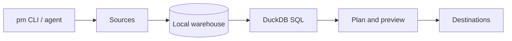

<div align="center">

# Polymetrics CLI

### One CLI to rule them all.

`pm` is a local-first data CLI for ETL, embedded DuckDB SQL, reverse ETL,
scheduling, and AI-agent-safe automation. It runs as one Go binary, keeps
credentials local, and speaks JSON everywhere.

[](https://cli.polymetrics.ai)
[](LICENSE)
[](https://goreportcard.com/report/github.com/polymetrics-ai/cli)

[](https://github.com/polymetrics-ai/cli/stargazers)

[Website](https://cli.polymetrics.ai) · [Docs](docs/GUIDE.md) · [Quickstart](#quickstart) · [Agent Contract](#agent-contract) · [Contributing](CONTRIBUTING.md)

</div>

---

Polymetrics turns the whole operational data loop into a command-line workflow:

```text
source -> extract -> local warehouse -> DuckDB SQL -> plan -> preview -> approve -> write back
```

No hosted control plane is required for the first useful run. Use it on a
laptop, in CI, in cron, in a container, or inside an LLM agent pod with the
same command surface.

## What It Does

| Surface | What you get |
| --- | --- |
| ETL | Pull records from APIs, databases, local files, and catalog-backed connectors. |
| SQL | Query extracted data locally with an embedded DuckDB engine. |
| Reverse ETL | Write results back through approval-gated destination actions. |
| Agents | Use `--json`, stable exit codes, and no silent mutation paths. |
| Catalog | Track a 646-connector catalog with active native Go ports. |
| Runtime | Keep credentials in an encrypted local vault. No server required. |

## Quickstart

Build from source:

```bash
git clone https://github.com/polymetrics-ai/cli
cd cli
make build
./pm version
```

Run a local extract and query loop with the sample connector:

```bash
export PM_SAMPLE_TOKEN=demo

./pm init
./pm credentials add sample --connector sample --from-env token=PM_SAMPLE_TOKEN
./pm credentials add warehouse --connector warehouse --config path=.polymetrics/warehouse
./pm connections create demo \
  --source sample:sample \
  --destination warehouse:warehouse \
  --stream customers \
  --primary-key id \
  --cursor updated_at \
  --table customers

./pm etl run --connection demo --stream customers --json
./pm query run --table customers --limit 5 --json
```

Release binaries are published on GitHub:

```bash
gh release download --repo polymetrics-ai/cli --pattern 'pm_*_darwin_arm64.tar.gz'
```

## Why It Exists

Data work is usually split across a pipeline service, a warehouse, a reverse
ETL product, a scheduler, and a separate automation interface. Polymetrics puts
the developer loop first: install one binary, connect a source, inspect data,
run SQL, then write back only after an explicit approval step.

This makes the tool useful for:

- Developers who want local-first ETL without provisioning infrastructure.
- Data engineers who need reproducible extract, query, and reverse ETL flows.
- AI agents that need a stable CLI contract instead of brittle prose parsing.
- Open-source contributors who want connector work to be small and testable.

## Agent Contract

Polymetrics is designed for humans and LLM agents to drive the same commands.

```bash
pm etl run --connection github --stream issues --json
pm query run --sql "select * from issues where state = 'open'" --json
pm reverse plan sync --source-table stale_issues --destination github:write --json
```

The contract is intentionally boring:

- `--json` returns versioned envelopes on stdout.
- Progress and logs go to stderr.
- Exit codes separate usage, validation, auth, connector, runtime, policy, and
  internal failures.
- Reverse ETL is split into `plan`, `preview`, `approve`, and `run`.
- Secrets are referenced by field name and never printed.

## Connectors

Use the CLI to inspect what is available in your binary and what is planned in
the catalog:

```bash
pm connectors list
pm connectors list --all
pm connectors inspect github --json
pm connectors port-plan --all --json
```

The repository tracks a 646-connector catalog. Enabled connector support is
expanding through native Go ports built on shared SDK primitives for auth,
pagination, retries, schema inference, read streams, and write actions.

## Architecture



- `internal/connectors` contains per-system connector packages.
- `internal/app` owns ETL, query, reverse ETL, scheduling, and automation flows.
- `cmd/pm` exposes the CLI.
- `docs` contains generated manuals and connector documentation.
- `website` publishes the docs, connector catalog, blog, `llms.txt`, and sitemap.

## Search And AI Discovery

The canonical description is:

> Polymetrics CLI is a local-first data CLI for single-binary ETL, embedded
> DuckDB SQL, reverse ETL, connector automation, and AI agent data workflows.

The README, docs, website metadata, blog, sitemap, and `llms.txt` use the same
terms deliberately so humans, search engines, and AI answer engines can identify
the project without keyword stuffing.

Canonical topics:

- local-first data CLI
- single-binary ETL
- embedded DuckDB SQL engine
- reverse ETL CLI
- AI agent data workflows
- connector catalog
- approval-gated writes

## Contributing

Connector PRs are the best first contribution. Start with the setup guide, copy
an existing connector package, add focused tests, and run verification before
opening a PR.

```bash
make verify
make verify-duckdb
```

Use Conventional Commits:

- `fix(github): handle paginated issue labels`
- `feat(connector): add source-linear`
- `docs(readme): clarify local-first quickstart`

## Roadmap

- [x] Local CLI runtime
- [x] JSON output and stable exit-code contract
- [x] Local encrypted credential vault
- [x] ETL, query, and approval-gated reverse ETL
- [x] Release binaries
- [x] Website docs, connector catalog, blog, sitemap, and `llms.txt`
- [ ] More native connector ports from the 646-connector catalog
- [ ] Homebrew tap
- [ ] Bundled MCP server
- [ ] Hosted examples and reproducible benchmark datasets

## License

[Elastic License 2.0](LICENSE) (c) 2026 Polymetrics AI.

Polymetrics CLI is public source and free to use under Elastic License 2.0. The
license does not permit offering the software to third parties as a hosted or
managed service where users access a substantial set of its functionality. For
commercial licensing beyond those terms, contact Polymetrics AI.
