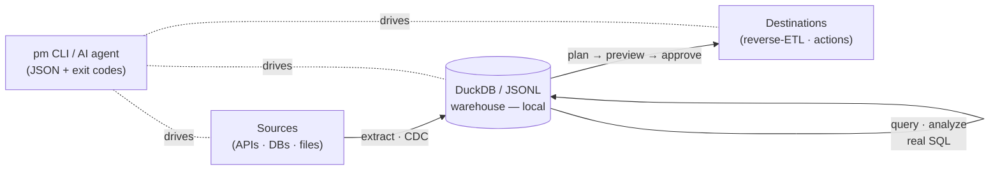

<div align="center">

# Polymetrics

### Fivetran capability. Zero infrastructure.

**`pm` is a local-first, single-binary data engine.** Extract from **118+ native connectors**, query the data with an **embedded DuckDB** SQL engine, and **write it back** to your tools — all from one Go binary that **AI agents can drive safely**. No SaaS. No Docker. Your data never leaves your machine.

[](https://polymetrics.ai)
[](LICENSE)
[](https://goreportcard.com/report/github.com/polymetrics-ai/cli)

[](#-contributing)
[](https://github.com/polymetrics-ai/cli/stargazers)

[Website](https://polymetrics.ai) · [Quickstart](#-quickstart-60-seconds) · [Why](#-why-polymetrics) · [Agent-native](#-agent-native) · [Compare](#-how-it-compares) · [Docs](docs/GUIDE.md) · [Roadmap](#-roadmap)

</div>

---

Moving data today means renting a cloud pipeline (Fivetran's surprise MAR bills), babysitting a Docker/Kubernetes deployment (connector registry's 8 GB of services), or wiring together a graveyard of half-maintained Singer taps. And once the data lands, you still need a *second* tool to push results back into the apps your team actually uses.

**Polymetrics is one binary that does the whole loop — extract, query, and act — locally.**

```text
  ANY SOURCE ──extract / CDC──▶  DuckDB warehouse  ──query · analyze──▶  DECIDE
  (118+ connectors)                (real SQL, local)                       │
                                                                           ▼
                              ANY DESTINATION  ◀──plan → preview → approve → write──┘
                                (reverse-ETL: write data back, take actions)
```

<!-- TODO: drop a vhs/asciinema terminal GIF of the quickstart here — the single highest-impact addition for stars. -->

## ⚡ Quickstart (60 seconds)

**Install** from a release binary, or with Go 1.25.11+:

```bash
# Release binary
os_name="$(uname -s)"
arch_name="$(uname -m)"

case "$os_name" in
  Darwin) os=darwin ;;
  Linux) os=linux ;;
  MINGW*|MSYS*|CYGWIN*) os=windows ;;
  *) echo "unsupported OS: $os_name" >&2; exit 1 ;;
esac

case "$arch_name" in
  x86_64|amd64) arch=amd64 ;;
  arm64|aarch64) arch=arm64 ;;
  *) echo "unsupported architecture: $arch_name" >&2; exit 1 ;;
esac

tmpdir="$(mktemp -d)"
trap 'rm -rf "$tmpdir"' EXIT
gh release download --repo polymetrics-ai/cli --pattern "pm_*_${os}_${arch}.*" --dir "$tmpdir"

case "$os" in
  windows)
    unzip -q "$tmpdir"/pm_*_"${os}"_"${arch}".zip -d "$tmpdir"
    binary_name=pm.exe
    ;;
  *)
    tar -xzf "$tmpdir"/pm_*_"${os}"_"${arch}".tar.gz -C "$tmpdir"
    binary_name=pm
    ;;
esac

install_dir="${INSTALL_DIR:-$HOME/.local/bin}"
mkdir -p "$install_dir"
cp "$tmpdir/$binary_name" "$install_dir/$binary_name"
chmod +x "$install_dir/$binary_name" 2>/dev/null || true
"$install_dir/$binary_name" version

# Or install with Go
go install polymetrics.ai/cmd/pm@latest      # installs the `pm` binary onto your PATH
```

<sub>Or build from source — <code>git clone https://github.com/polymetrics-ai/cli && cd cli && make build</code> (produces <code>./pm</code>; <code>make build</code> auto-fetches the Go 1.25.11 toolchain).</sub>

**Run** a full extract → land → query loop with zero external services:

```bash
export PM_SAMPLE_TOKEN=demo
pm init
pm credentials add sample    --connector sample    --from-env token=PM_SAMPLE_TOKEN
pm credentials add warehouse --connector warehouse --config path=.polymetrics/warehouse
pm connections create demo \
  --source sample:sample --destination warehouse:warehouse \
  --stream customers --primary-key id --cursor updated_at --table customers

pm etl run   --connection demo --stream customers --json   # 1. extract
pm query run --table customers --limit 5 --json            # 2. analyze
```

<sub>Built from source instead of <code>go install</code>? Use <code>./pm</code>, or run <code>make install</code> to put <code>pm</code> on your PATH.</sub>

That's a full **extract → land → query** loop with zero external services. Swap `sample` for `github`, `stripe`, `postgres`, `slack`, `hubspot`, or any of the [118+ connectors](#-connectors) — then add a `reverse` step to write results back.

## 🎯 Why Polymetrics

- **🧩 One binary, the whole loop.** ETL **and** reverse-ETL **and** SQL analytics in a single static Go executable. Most tools do one. We do all three.
- **🏠 Local-first.** Credentials live in an encrypted local vault; data lands in a local warehouse. Nothing is shipped to a vendor cloud unless *you* write it there.
- **🤖 Agent-native by design.** Every command speaks `--json`, exit codes are stable and branchable, and every write is approval-gated (`plan → preview → approve → execute`). An LLM agent can run the whole pipeline without a human in the hot path — and can't mutate a destination by accident. ([details](#-agent-native))
- **🦆 Real analytics built in.** An embedded **DuckDB** engine runs joins, aggregations, and window functions over your extracted data — no separate warehouse required.
- **🔄 Bidirectional.** Pull issues out of GitHub *and* open pull requests back into it. Read your warehouse *and* upsert contacts into HubSpot. Sources and destinations are the same unified connector.
- **🔌 118+ native connectors and counting.** Hand-written Go on a shared HTTP/DB toolkit — on the way to the full **600+ connector catalog**.
- **🪶 Dependency-light.** The default build is pure Go (CGO-free, trivially cross-compiled). DuckDB analytics is an opt-in build tag.

## 🤖 Agent-native

Polymetrics is built to be **driven by AI agents**, not just humans. The contract is explicit:

**1. Everything is JSON.** Add `--json` to any command for a structured envelope (`api_version`, `kind`, typed fields). Logs and progress go to stderr; data goes to stdout.

```jsonc
// pm etl run --connection demo --stream customers --json
{ "api_version": "polymetrics.ai/v1", "kind": "Run",
  "run": { "status": "completed", "records_read": 3, "records_loaded": 3 } }
```

**2. Exit codes are stable and branchable.** No parsing required to decide what to do next:

| Code | Category | Meaning | Agent action |
|---:|---|---|---|
| `0` | — | success | continue |
| `2` | usage | bad command/flags | fix invocation, don't retry |
| `3` | validation | bad input | fix arguments, don't retry |
| `4` | auth | missing/invalid credentials | obtain credentials |
| `5` | connector | connector/API error | inspect, maybe retry |
| `6` | runtime | local dependency unavailable | start dependency |
| `7` | policy | blocked by policy (e.g. approval) | obtain approval, then retry |
| `1` | internal | unexpected error | report |

**3. Writes are gated, never silent.** Reverse-ETL follows `plan → preview → approve → execute`. The agent gets a diff of exactly what *would* change and a one-time approval token; nothing mutates a destination until the agent (or a human) replays the command with `--approve`.

```bash
pm reverse plan sync --source-table candidates --destination github:write \
  --action create_pull_request --map title:title --map body:body --json   # returns a plan + approval token + sample
pm reverse preview <plan-id> --json                                        # see exactly what will be written
pm reverse run <plan-id> --approve <token> --json                          # only now does anything change
```

Secrets are never printed or logged — only secret *field names* surface in docs and manifests.

## 📊 How it compares

| | **Polymetrics** | connector registry | Fivetran | dlt | Hightouch / Census |
|---|:---:|:---:|:---:|:---:|:---:|
| **Deploy** | Single local binary | Docker/K8s (8 GB+) or Cloud | Cloud SaaS | Python library | Cloud SaaS |
| **Direction** | ✅ ETL **+** reverse-ETL | ETL only | ETL only | ETL only | ⚠️ reverse-ETL only |
| **Built-in SQL / analytics** | ✅ embedded DuckDB | ❌ | ❌ | ❌ | ❌ |
| **CDC** | ✅ snapshot + incremental*  | ✅ | ✅ | ⚠️ partial | ❌ |
| **Agent-friendly** | ✅ `--json` + exit codes + gated writes | partial (API) | partial (API) | code-native | API/UI |
| **Data stays local** | ✅ | ⚠️ self-host only | ❌ | ✅ | ❌ |
| **Cost** | ✅ free / flat | credit-based | ❌ usage-priced | free | ❌ $$$ |
| **Connectors** | 118 → 600+ | 600+ | 700+ | few verified | 200+ |

<sub>Polymetrics is younger: it has fewer connectors today and **no managed orchestration, scheduling, hosted UI, or SLAs** — it's a local engine, not a managed platform. *Logical-replication CDC (Postgres) is in progress; snapshot + cursor-incremental ships today.*</sub>

**Where it wins:** no infrastructure to run, predictable cost, both directions in one tool, SQL built in, and a CLI an agent can actually drive.

## 🔌 Connectors

**118 native Go connectors** are implemented today, with a **646-connector catalog** as the roadmap.

```bash
pm connectors list              # connectors available in your binary
pm connectors list --all        # the full catalog (implemented + planned)
pm connectors inspect stripe    # auth, streams, sync modes, write actions
```

Highlights: `github` · `gitlab` · `stripe` · `postgres` · `slack` · `hubspot` · `notion` · `jira` · `sendgrid` · `airtable` · `intercom` · `klaviyo` · `mailchimp` · `zendesk-support` · `square` · `xero` · `shopify` · … plus the long tail. Databases support snapshot + incremental reads (logical-replication CDC in progress); SaaS connectors support incremental reads and, where the API allows, approval-gated writes.

## 🏗️ Architecture



- **Connectors** — one Go package per system on a shared `connsdk` toolkit (auth, pagination, retry, schema inference). A derived registry wires them in automatically.
- **Warehouse** — pure-Go JSONL by default; opt into an embedded **DuckDB** engine (`-tags duckdb`) for analytical SQL.
- **Vault** — AES-GCM encrypted local credential storage.
- **Reverse-ETL** — plan/preview/approve/execute with time-bounded, single-use approval tokens.

Full details, build options, sync modes, and per-connector usage are in the **[Setup & Usage Guide →](docs/GUIDE.md)**.

## 📚 Documentation

- **[Setup & Usage Guide](docs/GUIDE.md)** — install, build options (incl. DuckDB), core concepts, ETL/query/reverse-ETL workflows, connector reference, agent integration, and troubleshooting.
- Built-in manuals: every command group is its own man page — `pm`, `pm etl`, `pm reverse`, `pm connectors`, … (add `--json` for the machine-readable version).

## 🗺️ Roadmap

- [x] Per-system connector architecture + shared `connsdk` toolkit
- [x] 118 native connectors (HTTP + Postgres)
- [x] Embedded DuckDB analytical query engine
- [x] ETL + approval-gated reverse-ETL + sync modes
- [ ] Remaining catalog → **600+ connectors**
- [ ] Logical-replication CDC (Postgres/MySQL/Mongo/SQL Server/Oracle)
- [x] Prebuilt release binaries
- [ ] Homebrew tap
- [ ] Bundled MCP server (same `plan → approve → execute` gate)
- [ ] Scheduling & incremental orchestration

## 🤝 Contributing

Contributions are very welcome — **adding a connector is the best first PR.** Copy an existing package (`internal/connectors/stripe/` for HTTP, `internal/connectors/postgres/` for databases), wire it up, and the derived registry picks it up automatically. See the [guide](docs/GUIDE.md#contributing-a-connector).

```bash
make verify          # gofmt + vet + go test ./... + build + smoke
make verify-duckdb   # the DuckDB (CGO) build lane
```

Use Conventional Commits for PR titles and squash commits. Connector updates use
`fix(<connector>): ...` for patch releases; new connectors use
`feat(connector): add <name>` for minor releases.

Look for [`good first issue`](https://github.com/polymetrics-ai/cli/labels/good%20first%20issue) to get started.

## ⭐ Star us

If a single local binary that extracts, analyzes, and writes back your data — and that your AI agent can drive — sounds useful, **star the repo** to follow along as we march toward 600+ connectors.

<a href="https://star-history.com/#polymetrics-ai/cli&Date">
  
</a>

## 📄 License

[Elastic License 2.0](LICENSE) © 2026 Polymetrics AI

Polymetrics CLI is public source and free to use under Elastic License 2.0. The license does not permit offering the software to third parties as a hosted or managed service where users access a substantial set of its functionality. For commercial licensing beyond those terms, contact Polymetrics AI.
