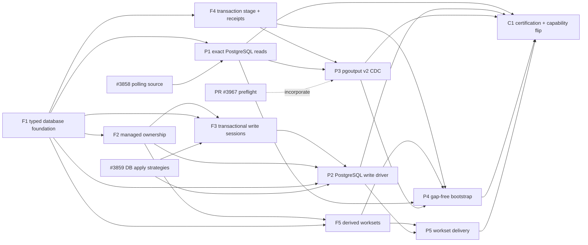

# PostgreSQL connector parity: definition, evidence, and issue tree

**Report revision:** r1  
**Repository:** `polymetrics-ai/cli`  
**Baseline inspected:** detached `origin/main` commit `f96a47e801b89f25386c33951a53a93d1a4c7c8d`  
**CDC branch inspected:** `origin/fm/cli-postgres-cdc-logical-replication-r1` commit `7c77e94e6844087160dfe031ddaf998c5725ac35`  
**Prepared:** 2026-08-10 (Asia/Kolkata)  
**Production code written:** none

## Executive result

PostgreSQL is a working **read-only polling source**, not a parity-complete database connector. The
default branch honestly publishes `read: true, write: false, cdc: false`. It can discover tables,
perform a bounded full read, and perform a simple single-column cursor read. It cannot write. Its
current cursor predicate is not duplicate-safe when multiple rows share a cursor value. Its type
catalog is deliberately coarse and silently maps unknown types to `string`.

The open CDC branch does **not** change that conclusion. It also publishes
`read: true, write: false, cdc: false`. It contains useful protocol and lifecycle work, including
the recently added server-capability preflight, but `ReadCDC` fails closed before connecting because
the required bounded, crash-recoverable transaction stage does not exist. The historical live
conformance test is skipped unconditionally “while change capture is planned.” A correctly
configured PostgreSQL server therefore cannot make CDC execute.

The engine has no database write executor or database write-session contract. A correction to the
initial shorthand is important: the repository does **not** have four peer executor kinds named
`rest_write`, `direct_write`, `binary_download`, and `file_upload`. `direct_write` is a CLI intent;
`rest_write`, `binary_download`, and `file_upload` are operation kinds, and a test explicitly states
that `file_upload` metadata is not itself an executor. The substantive claim is nevertheless
confirmed: there is no database operation kind, database write executor, or transactional database
write session anywhere in the current engine.

Complete parity is not “263 PostgreSQL endpoints” or unrestricted SQL coverage. Under the accepted
designs it means a truthful, certified behavioral matrix:

- exact and bounded full, cursor-incremental, and transaction-preserving change-capture reads;
- managed-target writes for the five honestly supportable non-history target modes;
- Polymetrics-created and Polymetrics-owned target tables with structural and in-database ownership
  assertions;
- closed, lossless type mapping and refusal of unsupported conversions;
- plan/preview/approval, atomicity, replay, tombstone, and unknown-commit safety;
- explicit resource bounds and operational telemetry; and
- real-binary plus live-container evidence before capability flags become true.

The proposed tree has eleven non-filler units. Five are shared database/change-delivery foundation
and six are PostgreSQL-specific delivery or certification. The critical path is explicit; the
framework, managed ownership, and write executor gate the write driver, while the transaction stage
gates executable CDC.

## Scope and authority

This report treats the following as binding and does not redesign them:

1. `data/cli-database-connector-framework-design-r1/report.md`: typed framework in
   `internal/connectors/database/`, PostgreSQL reference driver, no generic SQL executor, no second
   sync-mode enum, no separate repository.
2. `data/cli-cdc-large-transaction-strategy-r1/report.md`: PostgreSQL 14+ streamed `pgoutput` v2,
   bounded stage, whole-transaction receipt before acknowledgement, fail-closed quota, no cursor
   fallback for change capture.
3. `data/cli-cdc-bidirectional-changefeed-design-r1/report.md`: one delivery workset contract with
   two truthfully different producers; committed source transactions inbound and keyed
   Parquet/DuckDB deltas outbound; explicit tombstones only in phase one.
4. `internal/synccontract/mode.go:8-31`: the sole advertised sync-mode vocabulary.
5. `data/captain.md:168-190` and the managed-target ruling incorporated into the framework design:
   every connector has an honest rate-limit declaration; Polymetrics creates and owns the target,
   scoped by workspace + connector + connection ID, and refuses a missing or foreign in-database
   owner assertion.

The work is planning and GitHub issue metadata only. Every implementation issue below requires the
repository's issue-first GSD/TDD lifecycle and its own production PR.

## Definition of complete database-connector parity

Parity is achieved only when every row below is implemented, truthfully declared, and certified.
An explicit, evidence-backed non-support decision can be parity; a metadata claim without an
executor and proof cannot.

| Dimension | Complete parity contract | PostgreSQL phase-one decision |
| --- | --- | --- |
| Connection and catalog | Typed, secret-safe connection configuration; strict TLS; cancellation and timeouts; exact discovery of schemas, tables, keys, column order, nullability, defaults, generated/identity columns, and native type parameters. | PostgreSQL driver is the reference implementation. `query` remains false; no arbitrary SQL surface is needed. |
| Full read | Stable snapshot semantics are named, rows are streamed in bounded pages/batches, cancellation propagates, and the run records the catalog/schema fingerprint it read. | Executable against a live supported PostgreSQL container and through the real `pm` binary. |
| Incremental cursor read | Resume position is a total, deterministic key such as `(cursor, primary-key tie-breaker)`; equal cursor values, composite keys, null policy, snapshot boundary, restart, and schema drift have defined behavior. | Replace the current `cursor > lower`/`ORDER BY cursor` query. A single scalar cursor is insufficient. |
| Change-capture read | Real executable CDC, not a marker interface: PostgreSQL 14+, `pgoutput` protocol v2 with `streaming=on`, private bounded transaction stage, abort discard, atomic commit publication, durable receipt before LSN acknowledgement, slot lifecycle/lag controls, schema/publication fingerprints, and gap-free bootstrap. | Cursor fallback is rejected. Quota exhaustion fails closed as `TransactionStageLimitExceeded` and sends no acknowledgement. |
| Write admission | A typed database manifest is validated at load time; execution admission verifies a registered compatible driver and target plan. Declarations and executors are distinct. | Capability remains false until the final certification issue. |
| Managed target | Polymetrics creates the target in a private namespace derived from workspace, source connector, and source connection ID. A control record and native identifiers (including relation OID/schema hash) are checked in the same database. Missing, unreadable, foreign, or drifted ownership is a hard refusal. | No adoption or mutation of arbitrary existing customer tables; no name-only ownership; no automatic phase-one schema evolution. |
| Type mapping | A closed, parameterized logical type algebra preserves integers, decimal precision/scale, floating values, bytes, text, UUID, JSON, dates/times/timestamps and timezone semantics, arrays where lossless, nullability, and opaque unsupported types. Planning rejects lossy or unknown mappings; execution revalidates values. | Never silently coerce an unknown PostgreSQL type to `string`/`VARCHAR`. |
| Destructive-write safety | Every database write follows plan → preview → explicit approval → execute. Plan hash binds destination identity, schema, mode, key, row count, and destructive effects. Overwrite uses an atomic managed-table strategy; truncate/drop are not smuggled through a row write. Unknown commit is explicit and never blindly retried. | Explicit tombstones are the only phase-one deletes. Physical absence does not mean delete. |
| Modes and replay | Mode semantics, idempotency, checkpoint point, duplicate behavior, key requirements, and recovery are executable and tested. | See the mode truth table below. |
| Resource/rate limits | No unbounded user-controlled read, write, stage, connection pool, transaction, prepared-parameter count, WAL-retention, or retry loop. Deadlines and cancellation are enforced; CDC exposes slot lag, staged bytes, oldest staged transaction, and quota failures. `rate_limits.json` is honest. | Provider HTTP pacing is `not_applicable` because PostgreSQL uses no provider HTTP API; native resource limits belong in the database/runtime contract and tests. “Unknown” is not an acceptable placeholder. |
| Certification | Contract/unit tests, conformance tests, failure injection, live supported-version containers, and real built-binary flows prove returned data and durable effects—not merely exit status. Generated help/docs/website and capability projection agree. | Prove API→PostgreSQL, PostgreSQL→API (existing source path, re-certified), PostgreSQL→PostgreSQL, and inbound CDC behavior. Flip `write`/`cdc` last. |

### Advertised sync-mode truth table

The canonical declarations are at `internal/synccontract/mode.go:8-31`. A database connector must
not invent a second enum.

| Canonical mode | PostgreSQL target support at parity | Required semantics |
| --- | --- | --- |
| `full_overwrite` | Yes | Atomic managed-table replacement; readers never see an absent/partial target; destructive scope is visible in preview and bound to approval. |
| `full_append` | Yes | Append all input. Delivery is at-least-once if commit outcome is unknown; do not claim exactly-once without a durable idempotency key. |
| `incremental_append` | Yes | Append the delivered incremental workset with the same honest retry semantics. |
| `incremental_upsert` | Yes | Key required; deterministic insert/update in one transaction; explicit tombstone can delete when approved. |
| `incremental_dedupe` | Yes | Key required; deterministic winning-row rule is captured in the plan and applied transactionally. |
| `incremental_dedupe_history` | No, explicitly unsupported in this phase | Only support later with an immutable, totally ordered history/archive contract. Ordinary mutable target rows are not history. |
| `change_capture` | Source/read mode only | It identifies inbound CDC production. It is not advertised as an outbound target write mode. Outbound continuous delivery consumes a derived workset and uses a supported target mode, initially keyed `incremental_upsert`. |

## Verified ground truth

### 1. Capability declaration

**Confirmed on both inspected refs.**

- Default branch `internal/connectors/defs/postgres/metadata.json:7-13` declares
  `check: true, read: true, write: false, query: false, cdc: false`.
- CDC branch
  `origin/fm/cli-postgres-cdc-logical-replication-r1:internal/connectors/defs/postgres/metadata.json:7-13`
  declares the same values.

### 2. Write stubs

**Confirmed.**

- `internal/connectors/native/postgres/connector.go:97-101` returns
  `connectors.ErrUnsupportedOperation` with no write behavior.
- `internal/connectors/native/mysql/connector.go:43-46` is materially identical.
- `internal/connectors/native/postgres/postgres_test.go:262-267` locks in the PostgreSQL unsupported
  result.

### 3. No database write executor

**Confirmed, with the taxonomy correction described in the executive result.**

- `internal/connectors/engine/schema/operations.schema.json:19-36` enumerates operation kinds and
  contains no database/table write kind.
- `internal/connectors/engine/schema/cli_surface.schema.json:69-88` defines `direct_write` as a CLI
  intent, not an operation executor.
- `internal/connectors/engine/direct_write.go:59-74` and `:362-380` admit direct writes only when the
  mapped operation kind is `rest_write`.
- `internal/connectors/engine/operation_multipart_test.go:258-262` explicitly says `file_upload`
  metadata does not turn an operation into an executor.
- `internal/connectors/engine/write.go:279-351` executes declarative per-record HTTP writes.
- `internal/connectors/engine/connector.go:186-232` delegates native writes directly to a connector
  and otherwise requires declarative write actions; there is no database session.
- A repository-wide search found no `DatabaseWriteExecutor`, `WriteSession`, `BeginWrite`,
  `database_write`, `table_write`, or `sql_write` symbol.

### 4. CDC is deliberately fail-closed

**Confirmed.**

- Default branch `internal/connectors/native/postgres/cdc.go:10-29` is an unsupported stub.
- CDC branch `.../cdc.go:20-29` declares the required transaction stage unavailable and the
  executor `planned`.
- CDC branch `.../cdc.go:36-53` returns that error before fixture validation, request validation,
  or any source connection.
- CDC branch `.../cdc_integration_test.go:18-24` skips unconditionally with the exact note:
  “historical PostgreSQL CDC conformance is disabled while change capture is planned.”
- Therefore a valid server cannot reach CDC behavior. The previously measured live container had
  `wal_level=logical` and a replication-capable role yet still observed the intentional stage
  refusal; the code order above independently proves why.

### 5. Server-capability preflight and PR #3967

**Confirmed in the branch; GitHub state is separately recorded below.**

- CDC branch `.../cdc_lifecycle.go:56-69` runs preflight before opening the replication connection.
- `.../cdc_lifecycle.go:72-108` checks `wal_level=logical`, positive replication-slot and WAL-sender
  capacity, and the current role's replication attribute with actionable fail-closed errors.
- Branch tip `7c77e94e6844087160dfe031ddaf998c5725ac35` is
  `fix(postgres): preflight logical replication server`.
- The branch still advertises `cdc: false` and still fails at the stage gate, so this is useful
  containment/preflight work—not executable CDC.
- PR #3967 was supplied as open and green. The post-report live retry confirms it is still open and
  non-draft, but **refutes the current-green part**: `gh-axi pr checks 3967` reported 17 passed,
  1 failed (`verify`), 5 skipped, and 1 pending (`security/snyk`). This is a moving GitHub-state
  observation, not a finding about the preflight code itself.

## Done versus remaining

“Done” means present on the inspected default branch unless a row explicitly says CDC branch.
“Partial” means useful code exists but does not satisfy the accepted parity contract.

| Area | State | Evidence | What remains |
| --- | --- | --- | --- |
| Native PostgreSQL registration | Done | `internal/connectors/native/nativeset/factories.go:20-29` and `internal/connectors/bundleregistry/registry.go:15-28` | None for registration. |
| Secret-safe connection/TLS parsing | Partial | `internal/connectors/native/postgres/connection.go:90-208` validates bare host, identifiers, secret password handling, and shared TLS modes. | Typed database manifest, explicit connection/statement timeouts, bounded pool settings, session policy, and live strict-TLS proof. |
| Dynamic catalog and primary keys | Partial | `internal/connectors/native/postgres/cataloger.go:41-124` discovers tables, columns, and ordered primary keys. | Exact native types/parameters, nullability/default/generated/identity metadata, stable relation identity and schema fingerprint. |
| Type mapping | Not parity-ready | `internal/connectors/native/postgres/cataloger.go:127-147` collapses numeric/time types and maps every unknown type to `string`. | Closed lossless shared algebra, PostgreSQL mapping, unsupported-type refusal, planning and execution value validation. |
| Full snapshot read | Partial | `internal/connectors/native/postgres/reader.go:26-59` opens a pool and reads a table; `:87-113` streams result rows. Fixture proof is at `postgres_test.go:158-187`. | Stable snapshot boundary, exact catalog fingerprint, bounded page contract, cancellation/deadline and live real-binary proof. |
| Cursor-incremental read | Partial with correctness gap | `internal/connectors/native/postgres/reader.go:62-84` uses only `cursor > lower` and `ORDER BY cursor`. Fixture test `postgres_test.go:189-208` only proves a high cursor returns fewer rows. | Composite total-order checkpoint, equal-cursor duplicate test, null/drift policy, restart proof and live container evidence. |
| Read resource bound | Partial | Default `read_limit` is 10,000 at `connection.go:17-24`. `connection.go:266-283` accepts `0`/`all`/`unlimited`; docs expose that at `defs/postgres/docs.md:45-46`. | Remove or tightly govern unbounded execution; cap pools/pages/transactions/parameters; test cancellation and memory bounds. |
| Canonical sync modes | Shared declaration done | `internal/synccontract/mode.go:8-31` lists all seven modes; `internal/synccontract/native.go:123-218` separates declaration/admission. | Database-specific execution semantics and compatibility checks for the honest five write modes. |
| Durable acknowledgement ordering | Shared primitive done | `internal/synccontract/commit.go:11-31` and `:51-96` require a durable acknowledgement before checkpoint persistence. | Whole-transaction receipt/stage implementation and binding to database target commit receipts. |
| Reverse-ETL safety shell | Partial shared base | `internal/app/app.go:1368-1483` plans/hashes, `:1734-1806` previews, and `:2106-2181` consumes approval before one connector `Write` call. | Sealed database target plan, mandatory DB preview, pinned transaction/session, ownership binding, target receipts and unknown-commit state. |
| Local warehouse ownership precedent | Done for local warehouse, reusable semantics | `internal/warehouse/layout.go:124-144` defines owner identity; `:282-308` structurally scopes paths; `:335-423` creates/asserts ownership and refuses mismatch/missing owner. | Equivalent in-database control record and native target identity; do not mistake local `owner.json` for target-database ownership. |
| PostgreSQL write | Missing | `internal/connectors/native/postgres/connector.go:97-101` and `postgres_test.go:262-267`. | Shared write framework/executor, managed-table provisioning/ownership, PostgreSQL driver, five modes, durability and live tests. |
| Database write executor/session | Missing | No database kind in `operations.schema.json:19-36`; HTTP-only direct path at `direct_write.go:59-74`; native delegation at `connector.go:186-232`. | Typed `DatabaseWriteExecutor`/`WriteSession` and app integration; never a generic SQL executor. |
| Managed target table | Missing | No target-database owner/control-table implementation; only local warehouse precedent above. | Create/own/assert target scoped by workspace + source connector + source connection ID; refuse adoption, foreign/missing owner and schema/OID drift. |
| CDC truth descriptor | Done as negative truth | Default `defs/postgres/changefeed.json:1-10` says `unsupported`; CDC branch declares `planned` and capability false. | Promote only after matching executable descriptor and live conformance. |
| CDC protocol/lifecycle code | Partial on PR #3967 branch | `cdc.go:36-53` deliberately blocks it; `cdc_lifecycle.go:56-108` adds server preflight. | Shared stage/receipt port, pgoutput v2 streaming, abort/commit behavior, slot health, gap-free bootstrap and live supported-version proof. |
| CDC conformance | Missing/disabled | CDC branch `cdc_integration_test.go:18-24` skips before reading integration config. | Unskipped positive and negative live tests against PostgreSQL 14+ using reusable `native/dbtest` harness. |
| Outbound derived change delivery | Missing | Accepted design only; no `ChangeDeliveryWorkset` or destination baseline implementation found. | Complete Parquet/DuckDB projection, keyed delta, explicit tombstone records, immutable workset/receipt, atomic baseline advance. |
| Rate-limit declaration | Missing for bundle | PostgreSQL bundle has no `rate_limits.json`. Shared contract supports `not_applicable` at `internal/connectors/connsdk/rate_limits.go:3-23` and tests the “no provider HTTP API” reason at `engine/bundle_test.go:657-683`. | Add honest `not_applicable` declaration; define native resource limits elsewhere rather than inventing HTTP pacing. |
| Certification contract | Missing | PostgreSQL bundle has no `certification.json`; docs say read-only at `defs/postgres/docs.md:3-9`. | Database-specific certification profile/evidence, real binary and live container flows, failures, docs/help/site parity, then capability flips. |

## Existing-work reconciliation

The local repository history contains evidence of an earlier open issue tree:

| Issue | Recorded title | Disposition in this plan |
| --- | --- | --- |
| #3118 | `feat(connectors): PostgreSQL official API parity parent` | Reference as prior work; do not treat its endpoint-count definition as the accepted database parity contract. |
| #3119 | `PostgreSQL: complete official API and operation ledger` | Superseded in scope: unrestricted SQL/protocol enumeration is not required parity and generic SQL is forbidden. |
| #3120 | `PostgreSQL: ETL/read streams and changefeed parity` | Reference; its broad lane is decomposed here into exact reads, executable CDC, and bootstrap. |
| #3121 | `PostgreSQL: bounded direct/provider-search/query and binary parity` | Explicitly not required: PostgreSQL `query` stays false and there is no provider HTTP/binary API. |
| #3122 | `PostgreSQL: reverse ETL typed write parity` | Reference; its old unmerged branch did not implement the later accepted managed-table/write-session contract. |
| #3123 | `PostgreSQL: provider CLI/config/help parity` | Fold into certification/surface work after executable behavior exists. |
| #3124 | `PostgreSQL: fixtures docs conformance and Connector Guard parity` | Fold relevant proof into each implementation slice and final certification. |
| #3125 | `PostgreSQL: certification and release evidence` | Reference/replace with the final behavior-based certification child below. |
| #2986 | shared changefeed foundation parent | External shared dependency/umbrella. The transaction-stage child below is a narrower accepted-design gap and must cross-link rather than claim #2986 complete. |
| #2988 | shared CDC state/lab foundation | External dependency to reconcile with the stage and live-certification work. |
| #3745–#3749 | #2986 changefeed contract/discovery, conformance, surfaces, generator children | Reuse landed truthful discovery work; do not duplicate it. Positive PostgreSQL conformance remains part of executable CDC/final certification. |
| #3810 | `feat(connectors): define durable database sync checkpoints and delete-aware history` (closed) | Reuse its canonical modes/checkpoint/delete envelope. The later accepted designs narrow phase-one history and delete semantics; do not reopen its broader history claim inside this tree. |
| #3811 | `feat(connectors): implement PostgreSQL bidirectional sync executor` (open) | Existing broad PostgreSQL umbrella spanning reads, CDC, writes and bootstrap. The P1–P5 children below decompose it into independently checkable accepted-design slices and cross-link it; #3811 is not itself one implementation PR. |
| #3855, #3856–#3860 | shared polling-watermark parent/corpus/preflight/source/apply/surface issues (open) | External foundations. P1 consumes #3858 rather than recreating the shared keyset executor. F3 extends #3859 with the later pinned write-session/approval/receipt requirements instead of duplicating apply strategies. |
| #3862/#3864 | any-to-any transport parent and closed dispatch child (open) | External transport orchestration dependency. Reuse its single-engine dispatch seam; do not create a PostgreSQL-only orchestrator. |
| PR #3967 | PostgreSQL logical-replication containment/preflight | Build on it or its merged result; do not duplicate the preflight. It is not executable CDC. |

The historical branch `origin/fm/cli-postgresql-parity-wave04-r1` contains an unmerged writer and
issue snapshots, but its route writes records directly to a caller-named relation and predates the
accepted managed-target, typed-framework, delivery-receipt, and ownership rulings. It is research
input, not completed parity and not a merge base for this plan.

Live GitHub search is the final deduplication authority. If any proposed child below already exists
with materially the same acceptance contract, the existing issue is linked under the new parent
instead of filing a duplicate.

## Parallelisable work breakdown

### Units and hard dependencies

| Key | Exact issue title | Classification | Hard dependencies | Can proceed in parallel with |
| --- | --- | --- | --- | --- |
| F1 | `Postgres Parity: establish the typed database connector foundation` | Shared foundation | None | Existing PR #3967 containment work |
| F2 | `Postgres Parity: enforce managed-target ownership and provisioning` | Shared foundation | F1 | F4, P1 |
| F3 | `Postgres Parity: bind database apply to transactional write sessions` | Shared foundation gap | F1, F2, #3859 | F5, P3 |
| F4 | `Postgres Parity: add committed-transaction staging and receipts` | Shared foundation, cross-link #2986/#2988 | F1 | F2, P1 |
| F5 | `Postgres Parity: derive immutable Parquet delivery worksets` | Shared foundation | F1, F2 | F3, P2 |
| P1 | `Postgres Parity: make full and cursor reads exact and resumable` | PostgreSQL-specific adapter | F1, #3858 | F2, F4 |
| P2 | `Postgres Parity: implement the managed-table write driver` | PostgreSQL-specific | F1, F2, F3, #3859 | P3 |
| P3 | `Postgres Parity: make pgoutput v2 change capture executable` | PostgreSQL-specific | F1, F4, P1 type contract; PR #3967 incorporated | P2 |
| P4 | `Postgres Parity: add gap-free snapshot-to-changefeed bootstrap` | PostgreSQL-specific | F4, F5, P1, P3 | P5 |
| P5 | `Postgres Parity: deliver derived worksets to managed targets` | PostgreSQL-specific integration | F5, P2 | P4 |
| C1 | `Postgres Parity: certify parity and publish truthful capabilities` | PostgreSQL-specific final gate | P1, P2, P3, P4, P5 | None on critical path |

### Dependency graph



### Execution waves

1. **Wave A:** F1. Existing #3856→#3857→(#3858 and #3859) and PR #3967 may proceed in their own
   trees; PR #3967 cannot promote CDC.
2. **Wave B:** after F1, run F2 and F4 in parallel. P1 starts as soon as F1 and external #3858 land.
3. **Wave C:** run F5 after F2; run F3 after F2 + external #3859; run P3 after F4 + P1. These are
   independent once their gates are met.
4. **Wave D:** run P2 after F3 + #3859, while P3 proceeds; then run P4 and P5 in parallel when their
   distinct inputs are ready.
5. **Wave E:** C1 is the only capability-promotion/release gate.

The graph deliberately does not pretend that a PostgreSQL writer can start before #3859, the later
write-session gap, and ownership contracts, or that CDC can start before the transaction stage. It
also consumes #3858 rather than filing a second shared keyset executor. Interface stubs may be
reviewed early, but no dependent implementation issue may claim its acceptance criteria before all
hard dependencies land.

## Issue filing result

The report and exact bodies were completed before the final GitHub pass. The quota then reset;
`gh-axi issue list --state all --limit 1400` found the older PostgreSQL and shared database work
reconciled above and no exact-title duplicate of this tree. Filing succeeded.

- **Parent:** [#3972 — Postgres Parity](https://github.com/polymetrics-ai/cli/issues/3972)
- **Children:** 11 created, all open, all with final (non-temporary) bodies
- **Sub-issue relationships:** `gh-axi issue subissue list 3972` reports `11 of 11 total`
- **Read-back audit:** all 12 exact titles matched; every child contains `## Acceptance and proof`;
  the parent contains `## Parent acceptance`; no temporary text or unresolved issue-reference token
  remains on GitHub.

| Key | Created issue | Classification |
| --- | --- | --- |
| F1 | [#3974 — establish the typed database connector foundation](https://github.com/polymetrics-ai/cli/issues/3974) | Shared foundation |
| F2 | [#3981 — enforce managed-target ownership and provisioning](https://github.com/polymetrics-ai/cli/issues/3981) | Shared foundation |
| F3 | [#3973 — bind database apply to transactional write sessions](https://github.com/polymetrics-ai/cli/issues/3973) | Shared foundation gap after #3859 |
| F4 | [#3975 — add committed-transaction staging and receipts](https://github.com/polymetrics-ai/cli/issues/3975) | Shared change-delivery foundation |
| F5 | [#3980 — derive immutable Parquet delivery worksets](https://github.com/polymetrics-ai/cli/issues/3980) | Shared outbound foundation |
| P1 | [#3976 — make full and cursor reads exact and resumable](https://github.com/polymetrics-ai/cli/issues/3976) | PostgreSQL adapter after #3858 |
| P2 | [#3982 — implement the managed-table write driver](https://github.com/polymetrics-ai/cli/issues/3982) | PostgreSQL-specific |
| P3 | [#3977 — make pgoutput v2 change capture executable](https://github.com/polymetrics-ai/cli/issues/3977) | PostgreSQL-specific |
| P4 | [#3979 — add gap-free snapshot-to-changefeed bootstrap](https://github.com/polymetrics-ai/cli/issues/3979) | PostgreSQL-specific integration |
| P5 | [#3983 — deliver derived worksets to managed targets](https://github.com/polymetrics-ai/cli/issues/3983) | PostgreSQL-specific integration |
| C1 | [#3978 — certify parity and publish truthful capabilities](https://github.com/polymetrics-ai/cli/issues/3978) | PostgreSQL final gate |

## Ready-to-file issue appendix

The titles and bodies below are the exact final filing text, including the resolved issue numbers.
Existing materially equivalent issues are linked and annotated in the parent rather than
duplicated.

### Parent

**Title:** `Postgres Parity`

**Body:**

---

## Outcome

Deliver complete, truthful PostgreSQL **database-connector parity** for the captain's API→database,
database→API, and database→database flows. Parity is a certified behavioral contract, not an
official-endpoint or SQL-statement count.

PostgreSQL is currently a read-only polling source. On the measured baseline its capabilities are
`read: true, write: false, cdc: false`; `Postgres.Write` is unsupported; no database write executor
exists; and the CDC branch deliberately fails closed until bounded transaction staging exists.

## Binding decisions

- Implement the accepted typed database framework in `internal/connectors/database/` with
  PostgreSQL as reference driver. No generic SQL executor, second sync-mode enum, or separate repo.
- Full and cursor-incremental reads must be exact and resumable.
- Change capture is PostgreSQL 14+ streamed `pgoutput` v2 with a bounded crash-recoverable stage,
  abort discard, whole-transaction receipt before LSN acknowledgement, fail-closed quota, and no
  cursor fallback.
- Target tables are created and owned by Polymetrics, structurally scoped by workspace + source
  connector + source connection ID, with an in-database ownership assertion. Refuse missing,
  unreadable, foreign, or drifted ownership; do not adopt arbitrary existing tables.
- Use only `internal/synccontract/mode.go`. Phase-one targets support
  `full_overwrite`, `full_append`, `incremental_append`, `incremental_upsert`, and
  `incremental_dedupe`. `incremental_dedupe_history` remains unsupported until a true immutable
  history contract exists. `change_capture` is a source mode, not a target write mode.
- Outbound continuous delivery derives keyed Parquet/DuckDB deltas and accepts explicit tombstones
  only. Physical absence is not a delete in phase one.
- Capability flags turn true only after real-binary and live-container certification.

## Children and dependency order

| Key | Child | Class | Depends on |
| --- | --- | --- | --- |
| F1 | #3974 | shared foundation | — |
| F2 | #3981 | shared foundation | F1 |
| F3 | #3973 | shared foundation gap | F1, F2, #3859 |
| F4 | #3975 | shared foundation; cross-link #2986/#2988 | F1 |
| F5 | #3980 | shared foundation | F1, F2 |
| P1 | #3976 | PostgreSQL-specific adapter | F1, #3858 |
| P2 | #3982 | PostgreSQL-specific | F1, F2, F3, #3859 |
| P3 | #3977 | PostgreSQL-specific | F1, F4, P1; incorporate PR #3967 |
| P4 | #3979 | PostgreSQL-specific | F4, F5, P1, P3 |
| P5 | #3983 | PostgreSQL-specific integration | F5, P2 |
| C1 | #3978 | PostgreSQL-specific final gate | P1–P5 |

F2 and F4 run in parallel after F1. P1 starts when F1 and external #3858 land. F3, F5, and P3 can
then run in parallel once their individual gates—including #3859 for F3—land. P4 and P5 are parallel
integrations. C1 is the sole promotion gate.

## Parent acceptance

- [ ] Every child is closed with its own issue-first GSD/TDD evidence and reviewed production PR.
- [ ] A real built `pm` binary proves API→PostgreSQL, PostgreSQL→API, PostgreSQL→PostgreSQL, and
      PostgreSQL change-capture flows against live supported containers.
- [ ] Tests assert returned rows, target rows, transaction boundaries, receipts/checkpoints, owner
      identity, and failure behavior—not only exit status.
- [ ] Destructive, replay, quota, cancellation, schema-drift, ownership-collision, commit-unknown,
      disconnect, and restart cases are proven.
- [ ] `rate_limits.json` honestly says provider HTTP limits are not applicable; native resource caps
      and CDC slot/WAL telemetry are enforced and documented.
- [ ] Help/manual/docs/website/generated artifacts agree.
- [ ] `write` and `cdc` become true only in C1 after all evidence is green; `query` stays false.

## Prior work to reference, not duplicate

Reconcile #3118–#3125, #3811, polling/apply tree #3855–#3860, transport tree #3862/#3864, shared
changefeed/state foundations #2986/#2988 and children #3745–#3749, and PR #3967. The earlier
operation-count tree and unmerged writer predate the accepted managed-target and write-session design
and do not themselves establish parity. The new narrow children decompose #3811; they do not make a
second shared polling or database-apply executor.

---

### F1

**Title:** `Postgres Parity: establish the typed database connector foundation`

**Body:**

---

## Classification

**Shared foundation** in `internal/connectors/database/`. PostgreSQL is the reference driver, but this
issue must not embed PostgreSQL SQL in shared code.

## Scope

Create the accepted typed database connector contract:

- strict `database.json` loading/schema and immutable projections;
- closed parameterized logical types and exact conversion compatibility;
- structured catalog, relation/key identity, schema fingerprint and stable read-plan types;
- structured source/target references carrying workspace, connector and connection identity;
- declaration-versus-executor admission and driver registration;
- bounded resource-policy types (pages/batches/pools/timeouts/parameters) and conformance seams.

Reuse `internal/synccontract.Mode`; do not introduce another mode enum. Do not add a generic SQL
executor, a database-shaped REST operation, target DDL, a write session, or PostgreSQL CDC here.
Consume closed semantic contract #3810 and coordinate with #3857/#3864 so manifest admission and
transport dispatch have one owner. This issue's unique scope is the accepted `database` package,
exact logical/catalog types and driver boundary; it does not recreate the polling executor.

## Dependencies

No open hard dependency. #3810 is closed input; #3857/#3864 are coordination edges. This is the
first hard gate for every other new child under #3972.

## Acceptance and proof

- [ ] Invalid/unknown manifests, logical types, resource policies, and driver declarations fail
      closed with secret-safe errors; immutable projections do not expose mutable internals.
- [ ] Admission cannot pass from a declaration alone and cannot pair a manifest with an incompatible
      driver/version.
- [ ] Type compatibility is exact/lossless and rejects unsupported mappings instead of defaulting to
      string.
- [ ] Structured refs preserve workspace + connector + connection identity without raw credentials.
- [ ] Unit/contract tests cover schema loading, identity, compatibility, cancellation and defensive
      projection; PostgreSQL compile-time conformance demonstrates the reference-driver seam.
- [ ] The issue follows discuss → `plan-phase --tdd` → execute → verify → code-review with Red/Green
      evidence. Focused Go tests, vet, connector boundary, generator validation and relevant docs
      gates pass.

---

### F2

**Title:** `Postgres Parity: enforce managed-target ownership and provisioning`

**Body:**

---

## Classification

**Shared foundation**. Defines managed-target identity and safety; database drivers supply native
introspection/DDL in later issues.

## Scope

Implement the accepted managed-target plan and ownership contract:

- target namespace derived from workspace + source connector + source connection ID;
- `TargetOwner`/`ManagedTargetRef`, managed metadata columns, control-record schema and provisioning
  truth table;
- expected native relation identifier, schema hash/version and ownership proof;
- idempotent create-or-assert state machine;
- hard refusal for missing, unreadable, foreign, name-colliding, moved, replaced, or drifted targets;
- no adoption of arbitrary existing customer tables and no automatic phase-one schema evolution.

Keep local warehouse `owner.json` as precedent, not as a substitute for an in-database assertion.

## Dependencies

Hard dependency: #3974. Gates #3973, #3980 and #3982.

## Acceptance and proof

- [ ] Table-driven tests cover absent namespace, first create, repeat create, correct owner, missing
      owner, foreign owner, unreadable owner, name collision, native-ID replacement, schema drift and
      concurrent provisioning.
- [ ] Every destructive or mutating transition is represented in a typed plan and cannot execute
      against an unasserted target.
- [ ] Identity never uses display name or credential material and cannot cross workspace/connector/
      connection boundaries.
- [ ] Driver fakes prove the state machine without generic SQL; no PostgreSQL-specific DDL lands in
      this issue.
- [ ] GSD/TDD Red/Green evidence and focused unit/race/cancellation tests pass.

---

### F3

**Title:** `Postgres Parity: bind database apply to transactional write sessions`

**Body:**

---

## Classification

**Shared foundation gap**. Consume #3859's native database apply strategies and add the later
accepted transactional session/approval/receipt contract. This is not a second apply executor and
not a generic SQL tool.

## Scope

Bind the #3859 apply executor to the accepted typed `DatabaseWriteExecutor` and pinned
`WriteSession` contract and integrate it with reverse ETL:

- sealed target plan and compatibility admission;
- begin/apply-bounded-batch/commit/rollback lifecycle on one pinned session;
- mandatory database preview before approval;
- approval hash binds target identity, schema fingerprint, mode, keys, row count and destructive
  effects;
- target durability receipt before delivery checkpoint;
- explicit committed, rolled-back, and commit-outcome-unknown results;
- atomic overwrite hook and mode-specific append/upsert/dedupe contracts.

Ordinary ETL must refuse to bypass the approved database path. No raw SQL strings, caller-selected
arbitrary relations, or per-record auto-commit abstraction.

Do not reimplement #3859's closed per-mode apply strategies or its conformance corpus. Reuse them and
add the missing session, ownership, approval and receipt guarantees.

## Dependencies

Hard dependencies: #3974, #3981, and existing #3859 (including its #3856/#3857 prerequisites).
Coordinate with #3864's one-engine transport dispatch. Gates #3982.

## Acceptance and proof

- [ ] Tests prove approval is consumed before mutation and a changed target/schema/mode/key/count
      invalidates it.
- [ ] Batch failure and cancellation roll back the whole session; checkpoint cannot advance before a
      confirmed durable commit receipt.
- [ ] Commit-outcome-unknown is surfaced and never blindly retried or mislabeled rolled back.
- [ ] `full_overwrite` is atomic; the #3859 append/upsert/dedupe strategies execute only through the
      pinned session and match the canonical modes.
- [ ] A fake driver records one pinned session and bounded batches; no test can pass via per-row
      `Connector.Write`.
- [ ] Real-binary integration is deferred to #3982/#3978, but app/contract integration tests and
      GSD/TDD Red/Green evidence are green here.

---

### F4

**Title:** `Postgres Parity: add committed-transaction staging and receipts`

**Body:**

---

## Classification

**Shared change-delivery foundation**. Cross-link and reconcile shared parents #2986 and #2988; this
is the narrower bounded transaction-stage/receipt gap identified by the accepted CDC design.

## Scope

Implement the source-agnostic committed-transaction sink used by database CDC:

- `BeginTransaction`/`AppendChunk`/`CommitTransaction`/`AbortTransaction` boundaries;
- private, crash-recoverable, streaming transaction stage with finite byte/record/time quotas;
- `TransactionStageLimitExceeded` fail-closed behavior;
- immutable whole-transaction delivery receipt;
- acknowledgement eligibility only after receipt durability;
- startup recovery, orphan cleanup and bounded disk accounting;
- cancellation and telemetry for staged bytes/records, oldest transaction and quota failures.

Do not add a PostgreSQL decoder, acknowledge source LSNs, or substitute a cursor poller.
Reuse #3810's checkpoint/change envelope and #3745/#3746's truthful descriptor work; do not
reimplement either.

## Dependencies

Hard dependency: #3974. Gates #3977 and #3979. Reconcile rather than duplicate #2986/#2988 work.

## Acceptance and proof

- [ ] Chunks of one transaction are invisible until commit and are published atomically/in order.
- [ ] Abort discards all staged chunks; restart recovers committed receipts and safely removes or
      resumes incomplete private stages according to the contract.
- [ ] Quota exhaustion returns the named error, publishes nothing, and produces no acknowledgement
      eligibility.
- [ ] Failure injection covers disk full, fsync/rename failure, receipt failure, cancellation and
      restart at every state transition.
- [ ] Tests keep memory bounded independently of transaction size and prove receipt-before-ack order
      through a fake source.
- [ ] GSD/TDD Red/Green, race and focused package evidence pass.

---

### F5

**Title:** `Postgres Parity: derive immutable Parquet delivery worksets`

**Body:**

---

## Classification

**Shared foundation** for outbound continuous delivery from the connection-owned warehouse.

## Scope

Implement the second truthful change producer from the accepted bidirectional design:

- a complete single-Parquet projection plus per-destination baseline;
- keyed DuckDB delta derivation for insert/update and explicit tombstone records;
- immutable `ChangeDeliveryWorkset` manifest with origin, destination, schema/key fingerprint,
  source/baseline versions, counts and content hash;
- durable delivery receipt and atomic baseline advancement only after target receipt;
- crash/replay behavior and bounded temporary resources.

Physical absence from a snapshot must not become a delete. API sinks and arbitrary destination
tables are out of scope.

## Dependencies

Hard dependencies: #3974 and #3981. Gates #3979 and #3983.

## Acceptance and proof

- [ ] DuckDB/Parquet fixtures prove deterministic inserts, updates, unchanged rows and explicit
      tombstones across composite keys and null/type edge cases.
- [ ] Physical absence never emits a tombstone.
- [ ] Identical inputs produce the same immutable workset/hash; changed schema/key/destination
      invalidates reuse.
- [ ] Baseline does not advance on target failure, unknown commit or receipt failure; replay reuses
      the same workset.
- [ ] Temporary disk/memory are bounded and cleaned under cancellation/restart.
- [ ] Focused integration tests use the repository's real DuckDB/Parquet implementation and include
      GSD/TDD Red/Green evidence.

---

### P1

**Title:** `Postgres Parity: make full and cursor reads exact and resumable`

**Body:**

---

## Classification

**PostgreSQL-specific**, built on the shared typed database foundation.

## Scope

Bring PostgreSQL polling reads to the accepted database-read contract:

- exact catalog/type mapping with PostgreSQL native type identifiers and parameters;
- a PostgreSQL adapter for #3858's shared polling/keyset source executor, not a second executor;
- stable full-snapshot boundary and schema fingerprint;
- deterministic composite keyset position `(cursor value, primary-key tie-breaker)`;
- defined equal-cursor, null, composite-key, schema-drift and restart behavior;
- bounded pages/batches, pools and deadlines with cancellation propagation;
- state/checkpoint encoding that cannot skip equal-valued rows.

Do not use cursor polling as a fallback for `change_capture` and do not expose arbitrary SQL query.

## Dependencies

Hard dependencies: #3974 and existing #3858 (including #3856/#3857). This is the PostgreSQL adapter
and live proof for that shared executor. Its exact type/fingerprint contract is also consumed by
#3977 and #3979. Cross-link broad PostgreSQL umbrella #3811 and old lane #3120.

## Acceptance and proof

- [ ] A regression fixture with more rows than one page and duplicate cursor values returns every
      expected primary key exactly once across restart.
- [ ] Full snapshot and incremental continuation behave deterministically under concurrent inserts
      at the declared snapshot boundary.
- [ ] Unsupported/lossy PostgreSQL types, null cursor policy and schema/key drift fail with specific,
      secret-safe errors.
- [ ] Cancellation/deadline closes rows and pools; configured hard caps cannot be disabled with
      `0`/`all`/`unlimited` in a certified run.
- [ ] Build the real `pm` binary and run reads against live supported PostgreSQL through the reusable
      `internal/connectors/native/dbtest` Podman harness; assert returned counts/keys/types, not exit
      status alone.
- [ ] Unit, integration and GSD/TDD Red/Green evidence pass.

---

### P2

**Title:** `Postgres Parity: implement the managed-table write driver`

**Body:**

---

## Classification

**PostgreSQL-specific** reference driver for the shared database write/ownership contracts.

## Scope

Implement PostgreSQL target behavior behind the typed driver:

- private namespace and control table creation;
- transactional create-or-assert with workspace + source connector + source connection ID,
  relation OID and schema hash;
- exact PostgreSQL DDL/type mapping and value encoding;
- pinned transaction, bounded COPY/batch application, rollback and durable commit receipt;
- `full_overwrite`, `full_append`, `incremental_append`, `incremental_upsert` and
  `incremental_dedupe`;
- atomic overwrite strategy and explicit tombstone deletes for keyed modes;
- server/session durability preflight including `fsync=on` and `synchronous_commit=on`.

Do not accept arbitrary existing tables, expose generic SQL, auto-evolve schema, implement physical-
absence deletes, or advertise `incremental_dedupe_history`.

## Dependencies

Hard dependencies: #3974, #3981, #3973, and existing #3859. This is the PostgreSQL driver behind the
shared strategies, not another apply executor. Cross-link broad umbrella #3811 and old write lane
#3122. Gates #3983 and final certification #3978.

## Acceptance and proof

- [ ] Live PostgreSQL tests prove first create, repeat assertion, all five modes, exact values/types,
      composite keys and atomic overwrite using returned target rows and counts.
- [ ] Live negative tests prove missing/foreign/unreadable owner, same-name collision, OID
      replacement, schema drift, unsupported type/value, permission denial and unsafe durability
      settings are refused before mutation.
- [ ] Failure injection proves statement/batch error and cancellation roll back; disconnect during
      commit reports unknown outcome and is not blindly retried.
- [ ] Concurrent writers cannot cross owner scope or leave a partially provisioned target.
- [ ] A real built `pm` binary completes approved API→PostgreSQL reverse ETL against the reusable
      `dbtest` live harness; test assertions inspect data and control records.
- [ ] Capability `write` remains false in this issue; #3978 flips it only after full certification.
- [ ] GSD/TDD Red/Green and focused unit/integration/race evidence pass.

---

### P3

**Title:** `Postgres Parity: make pgoutput v2 change capture executable`

**Body:**

---

## Classification

**PostgreSQL-specific** CDC producer using the shared committed-transaction stage.

## Scope

Replace the intentional fail-closed gate with PostgreSQL 14+ executable logical replication:

- incorporate, do not duplicate, the server preflight and safe lifecycle work from PR #3967;
- negotiate `pgoutput` protocol v2 with `streaming=on`;
- decode relation/type/origin/begin/stream-start/chunk/stream-stop/stream-commit/stream-abort messages;
- stage chunks privately under the shared finite quota;
- discard `StreamAbort` and publish one ordered source transaction only at `StreamCommit`;
- wait for a durable whole-transaction receipt before standby status acknowledges the commit LSN;
- manage publications/slots, lag/retention thresholds, disconnect/restart and explicit teardown;
- bind relation/schema/publication fingerprints and exact PostgreSQL values.

No cursor fallback, no PostgreSQL 12/v1 certification, no per-row acknowledgement, and no capability
flip here.

## Dependencies

Hard dependencies: #3974, #3975, and #3976's exact type/fingerprint contract. Incorporate PR #3967 or
its merged commit. Cross-link broad umbrella #3811, #2986/#2988 and conformance issue #3747. Gates
#3979 and #3978.

## Acceptance and proof

- [ ] The formerly skipped conformance path is replaced by executable PostgreSQL 14+ live tests;
      no positive CDC test skips after integration opt-in is valid.
- [ ] A transaction larger than memory is streamed into a bounded stage, remains invisible before
      commit, and is delivered atomically/in order after commit.
- [ ] Abort, quota exceed, stage failure and downstream receipt failure publish/checkpoint/ack
      nothing; source WAL remains recoverable.
- [ ] Disconnect/restart before and after receipt proves replay and acknowledgement ordering with no
      gap; schema/publication drift fails closed.
- [ ] Slot creation/collision/active-owner/lag/retention/teardown and server preflight are asserted
      in live containers; cleanup is unconditional and scoped to test-owned resources.
- [ ] Tests run through the reusable `dbtest` Podman harness and a real built `pm` binary where the
      command surface is involved; data, transaction boundaries, LSNs and slot state are asserted.
- [ ] GSD/TDD Red/Green evidence passes; descriptor/capability remain planned/false until #3978.

---

### P4

**Title:** `Postgres Parity: add gap-free snapshot-to-changefeed bootstrap`

**Body:**

---

## Classification

**PostgreSQL-specific integration** of exact snapshot reads, pgoutput transactions and the common
delivery workset.

## Scope

Implement and recover the accepted gap-free PostgreSQL bootstrap:

- establish slot/snapshot barrier and record source system/timeline, publication, relation/schema
  fingerprints and initial LSN;
- emit the initial stable snapshot into the connection-owned WAL/Parquet path;
- retain and then apply committed logical-replication transactions strictly after the barrier;
- produce immutable manifests/receipts and advance source checkpoint only after durable downstream
  receipt;
- detect invalidated slots, timeline/system changes, schema/publication drift and rebootstrap needs;
- bound concurrent WAL retention, stage storage and snapshot resources.

Do not paper over an invalid slot with cursor mode and do not silently recreate a slot without an
explicit rebootstrap decision.

## Dependencies

Hard dependencies: #3975, #3980, #3976, and #3977. This is the bootstrap slice decomposed from #3811.
Can run in parallel with #3983 once ready.

## Acceptance and proof

- [ ] A live test writes before, during and after bootstrap and proves every committed row/change
      appears exactly in the correct snapshot/change boundary with no gap.
- [ ] Multi-row transactions remain atomic; explicit deletes are tombstones.
- [ ] Crash/restart is injected at barrier creation, snapshot materialization, receipt, checkpoint
      and acknowledgement boundaries; recovery never advances past undurable work.
- [ ] Slot invalidation, WAL-retention quota, timeline/system mismatch and schema/publication drift
      fail closed with an actionable rebootstrap state.
- [ ] Live PostgreSQL 14+ `dbtest` and real-binary runs assert rows, manifests, checkpoints, LSNs,
      receipts and slot state—not process exit alone.
- [ ] GSD/TDD Red/Green evidence passes.

---

### P5

**Title:** `Postgres Parity: deliver derived worksets to managed targets`

**Body:**

---

## Classification

**PostgreSQL-specific integration** for outbound continuous database-to-database delivery.

## Scope

Consume the shared immutable Parquet/DuckDB workset through the managed PostgreSQL write driver:

- seal destination owner/table identity, schema/key fingerprints and workset hash into plan/preview;
- require explicit approval before the first mutation;
- initially apply keyed worksets using `incremental_upsert`;
- apply only explicit tombstones as deletes;
- return durable target receipts and atomically advance the per-destination baseline/checkpoint;
- make replay, unknown commit and destination drift behavior explicit.

This is the accepted outbound producer/delivery path. It is not source-transaction preservation, an
API sink, arbitrary-table replication, or physical-absence deletion.

## Dependencies

Hard dependencies: #3980 and #3982. Reuse #3864's one-engine dispatch and treat this as the outbound
delivery slice decomposed from #3811. Can run in parallel with #3979. Gates #3978.

## Acceptance and proof

- [ ] Live source-Parquet→managed-PostgreSQL tests prove insert, update, unchanged, composite key and
      explicit tombstone results by querying actual target rows.
- [ ] No tombstone is produced from physical absence.
- [ ] Plan hash changes on destination owner/OID/schema/key/workset change; stale approval is refused
      before mutation.
- [ ] Target failure, receipt failure and unknown commit do not advance the destination baseline;
      replay uses the identical immutable workset and documented mode semantics.
- [ ] Concurrent destinations keep independent baselines and cannot cross workspace/connector/
      connection ownership.
- [ ] Real built `pm` PostgreSQL→PostgreSQL flow runs against live `dbtest` containers with bounded
      batches and cancellation; receipts and checkpoints are asserted.
- [ ] GSD/TDD Red/Green evidence passes.

---

### C1

**Title:** `Postgres Parity: certify parity and publish truthful capabilities`

**Body:**

---

## Classification

**PostgreSQL-specific final certification and release gate.** No new core behavior should be invented
here; gaps found by certification return to their owning issue.

## Scope

Certify the complete behavioral matrix and only then publish capability/surface truth:

- real-binary flows for API→PostgreSQL, PostgreSQL→API, PostgreSQL→PostgreSQL and PostgreSQL CDC;
- supported PostgreSQL version matrix (minimum 14 for CDC) through reusable `native/dbtest` Podman
  containers;
- positive mode/read/type/CDC coverage plus ownership, destructive safety, resource, crash/replay,
  unknown-commit, cancellation, slot/WAL and drift failures;
- PostgreSQL `certification.json`/database profile, honest `rate_limits.json`
  `state: not_applicable` with no-provider-HTTP reason, docs/help/manual/website/generated parity;
- final `write` and `cdc` capability flips only after all executable descriptors match.

Keep `query: false`. Record `incremental_dedupe_history`, cursor fallback, physical-absence deletes,
API changefeed sinks, arbitrary existing targets and generic SQL as explicit non-support—not hidden
gaps.

## Dependencies

Hard dependencies: #3976, #3982, #3977, #3979, and #3983, including every transitive shared foundation.
Cross-link old certification lane #3125 and broad PostgreSQL umbrella #3811; this issue replaces
their operation-count/broad claims with the accepted behavior-based proof gate.

## Acceptance and proof

- [ ] Build `pm` once and run the four named flows against live supported containers; assert exact
      source/target records, types, transaction boundaries, receipts and checkpoints.
- [ ] Certification includes duplicate-cursor pages, all five write modes, explicit tombstones,
      owner collisions, stale approval, rollback, commit unknown, stage quota, slot lag/invalidation,
      restart and schema/publication drift.
- [ ] Tests visibly skip before startup without live opt-in/explicit local Podman endpoint, but fail
      rather than skip when opted in and unavailable; all resources are uniquely owned and cleaned.
- [ ] Resource caps, timeouts, pool/batch/page/parameter bounds, CDC stage quota and slot/WAL
      telemetry are asserted. `rate_limits.json` is `not_applicable`, never `unknown`.
- [ ] `pm connectors inspect postgres --json`, catalog filters, runtime help, bare namespace/help,
      docs, website and generated artifacts all make identical claims.
- [ ] `write: true` and `cdc: true` land in the same green slice as matching executors and
      certification. `query` remains false.
- [ ] Full repository-required GSD/TDD, focused local gates, CI, automated review disposition and
      human release gate are recorded.

---

## Evidence and reproducibility ledger

### Commands run

All commands were read-only except writing this report/status. No provider credentials were read or
printed.

```text
git status --short --branch
git rev-parse HEAD
git log -1 --format='%cI %s'

rg --files internal/connectors/native/postgres internal/connectors/database
rg -n 'DatabaseWriteExecutor|WriteSession|BeginWrite|database_write|table_write|sql_write' \
  internal cmd
rg -n 'rest_write|direct_write|binary_download|file_upload' internal/connectors/engine

nl -ba internal/connectors/defs/postgres/metadata.json
nl -ba internal/connectors/native/postgres/{connector.go,reader.go,cataloger.go,connection.go,cdc.go}
nl -ba internal/connectors/native/postgres/postgres_test.go
nl -ba internal/connectors/native/mysql/connector.go
nl -ba internal/connectors/engine/schema/{operations.schema.json,cli_surface.schema.json}
nl -ba internal/connectors/engine/{direct_write.go,write.go,connector.go,operation_multipart_test.go}
nl -ba internal/synccontract/{mode.go,native.go,commit.go}
nl -ba internal/warehouse/layout.go

git show origin/fm/cli-postgres-cdc-logical-replication-r1:<path> | nl -ba
git log -1 origin/fm/cli-postgres-cdc-logical-replication-r1
git diff --stat origin/main...origin/fm/cli-postgresql-parity-wave04-r1

go test -count=1 -timeout 20m ./internal/connectors/native/postgres \
  -run 'Test(NameAndMetadata|ReadFixtureEmitsRows|ReadFixtureIncrementalCursor|CDCUnsupportedStub|WriteUnsupported)$'

gh-axi issue list --state all --limit 1400
gh-axi issue view 3118 --full
gh-axi issue view 3811 --full
gh-axi issue view 3855 --full
gh-axi issue view 3859 --full
gh-axi pr view 3967 --full
gh-axi pr checks 3967
gh-axi issue create ...
gh-axi issue edit ...
gh-axi issue subissue add 3972 3974 3981 3973 3975 3980 3976 3982 3977 3979 3983 3978
gh-axi issue subissue list 3972
```

Focused test result:

```text
ok  	polymetrics.ai/internal/connectors/native/postgres	0.840s
```

### Accepted-design anchors used

- Typed framework/no generic SQL: `cli-database-connector-framework-design-r1/report.md:12-27`.
- Warehouse-mediated route: same report `:38-66` and `:626-669`.
- Current missing executor diagnosis: same report `:68-107`.
- Write-session/executor contract: same report `:250-307`.
- Current equal-cursor hole: same report `:362-367`.
- Write state machine/modes/type map/ownership/durability: same report `:427-607`.
- PostgreSQL roadmap and proof bar: same report `:728-842` and `:883-924`.
- Managed-target ruling/addendum and live slice: same report `:932-938` and `:1448-1637`.
- Large-transaction mechanics/receipt order/no shortcut: `cli-cdc-large-transaction-strategy-r1/report.md:23-52`,
  `:177-235` and `:284-346`.
- Two producers/delete/replay/mode truth/verification:
  `cli-cdc-bidirectional-changefeed-design-r1/report.md:12-51`, `:279-322`, `:324-469` and
  `:491-510`.

### Limitations

- GitHub's live issue/PR search and mutation were intentionally deferred until this report and exact
  bodies were complete. The initial `gh-axi` calls hit the stated fleet-wide GraphQL quota; the
  final retry succeeded and the complete tree is filed above.
- The CDC branch live-container observation is supplied prior evidence. This scout did not rerun a
  container because the code unconditionally refuses before connection and this lane had no
  explicit `POLYMETRICS_PODMAN_ENDPOINT`; using the global/default Podman connection would violate
  the repository harness contract. The source-order proof independently confirms that even a valid
  server cannot be contacted. The certification issues explicitly require new live proof.
- Default-branch fixture tests establish the present read/stub baseline only; they do not certify
  parity.

### Completion gate

The full report and the project-styled Lavish review surface were inspected. One transient 2-pixel
heading clip was corrected; the second browser audit produced no fresh layout warning. No unresolved
captain choice remains: the accepted designs and existing captain rulings determine the tree, while
PR #3967's failing check is operational state owned by that PR. The required durable gate passed:

```text
complete: cli-postgres-parity-issue-tree-r1 decision inventory reviewed
verified: cli-postgres-parity-issue-tree-r1 unresolved-decision inventory
```

## Recommendation

Approve this behavior-based tree as the canonical PostgreSQL parity plan. Reference and, where
appropriate, close/supersede the older #3118–#3125 endpoint-count tree rather than extending its
generic-SQL model. Land F1 first; immediately fan out F2, F4 and P1; keep capability declarations
false until C1. This is the shortest plan that can unlock all three captain flows without hiding the
shared engine work inside PostgreSQL-specific code.
